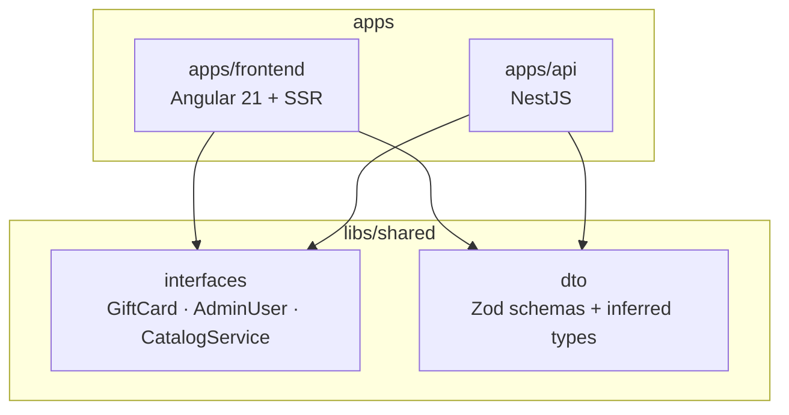
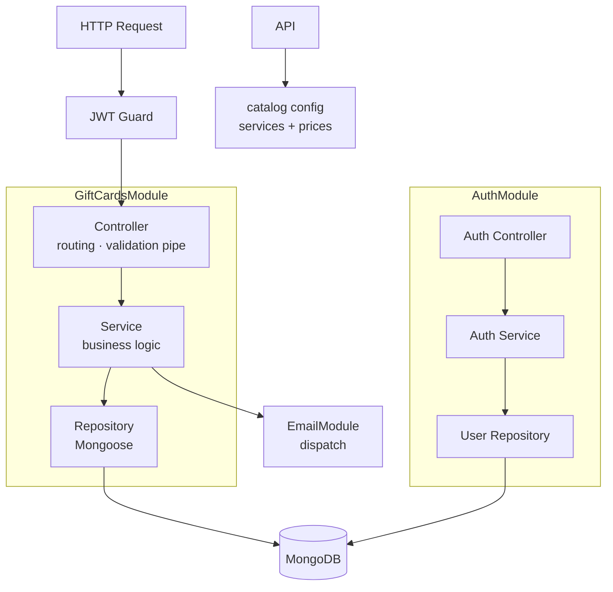

# Backend Architecture — Personalized Gift Cards

## Summary

Integrate a NestJS modular-monolith backend (`apps/api/`) into the existing Nx workspace alongside the Angular frontend (migrated to `apps/frontend/`). Phase 1 delivers an admin-only gift-card API: create, store, and email personalized cards tied to a config-driven service catalog, with unique redemption codes, timestamped redemption, and full session auth (admin users in MongoDB, bcrypt passwords, JWT). Shared Zod contracts in `libs/shared/` ensure frontend and backend share the same types from day one. Payments and a public-facing purchase form are deferred to Phase 2.

---

## Problem Frame

The `take-my-energy` frontend currently serves static data from `src/app/data/services.data.ts`. Gift card management — creating personalized cards tied to specific services, delivering them by email, and tracking redemption with a timestamp — requires persistent storage, server-side email dispatch, and an admin interface that static files cannot provide. Adding a backend inside the same Nx workspace preserves the dependency graph, enables shared TypeScript contracts, and positions the project to add payment integration incrementally.

---

## Key Decisions

- **NestJS modular monolith over microservices or raw Express.** Phase 1 scope (admin CRUD + email) does not justify microservices operational overhead. Extending the existing Express SSR server would mix SSR and API concerns in one process with no structure to grow into. NestJS provides dependency injection, module-level boundaries, and first-class Nx integration via `@nx/nestjs` — the Angular team's decorator/module mental model transfers directly.

- **Angular app migrates to `apps/frontend/`.** Moving the Angular project from the workspace root to `apps/frontend/` produces a clean `apps/` layout and makes the Nx project graph readable. The SSR entry (`server.ts`) moves with it. This is a one-time migration cost paid before any backend scaffold runs.

- **Zod for shared validation over class-validator.** Zod schemas live in `libs/shared/dto` and are usable in both Angular (reactive form validation) and NestJS (pipes/guards). `class-validator` is NestJS-specific and cannot be consumed by the frontend without a separate type layer — it would break the single-source-of-truth contract.

- **MongoDB as the primary data store.** Consistent with the workspace's existing VSCode extension recommendations. `@nestjs/mongoose` integrates cleanly with NestJS modules and suits the gift-card domain's document-shaped data.

- **Full session auth for the admin API.** Admin users are stored in MongoDB with bcrypt-hashed passwords. Login issues a signed JWT; protected endpoints validate it via a NestJS guard. This enables proper user management and avoids re-architecting auth when the admin team grows.

- **Service catalog is config-driven, not a database collection.** Services (name + price) are defined in a backend config or seed file — the same data already living in `src/app/data/services.data.ts`. No `ServicesModule` or Mongoose model is needed for Phase 1. Admin selects a service from this list when creating a gift card; the service snapshot (name + price) is stored on the gift card document itself.

- **All-or-nothing redemption with a timestamp.** A gift card is either active or fully redeemed — no partial balance tracking. Redemption records a `redeemedAt` timestamp so staff can see exactly when a card was used. Marking an already-redeemed card is idempotent.

- **No expiry.** Gift cards are valid indefinitely. No `validUntil` field, no expiry enforcement, no scheduled job.

---

## Requirements

### Workspace restructuring

- R1. The Angular application is moved from the workspace root to `apps/frontend/`, with `project.json`, `tsconfig.*`, and `server.ts` updated to reflect the new location.
- R2. All existing build, serve, test, and SSR targets continue to work after the move, verified by `pnpm nx build frontend` and `pnpm nx serve frontend`.
- R3. A NestJS application is scaffolded at `apps/api/` using the `@nx/nestjs:application` generator.
- R4. The Nx project graph reflects `api` and `frontend` as sibling projects, each with a dependency edge to `libs/shared/`.

### Shared contract layer

- R5. A `libs/shared/interfaces` library exports TypeScript interfaces for all core domain models (at minimum: `GiftCard`, `AdminUser`, `CatalogService`).
- R6. A `libs/shared/dto` library exports Zod schemas for all API input shapes (at minimum: `CreateGiftCardSchema`, `LoginSchema`), with inferred TypeScript types exported alongside each schema.
- R7. Both `apps/frontend` and `apps/api` import shared types exclusively from `libs/shared/*` — no type duplication between the two apps.

### Backend — layered architecture

- R8. The NestJS application follows a three-layer structure per feature module: a controller/routing layer (HTTP handlers and validation pipes), a domain/service layer (business logic), and a data-access layer (Mongoose repositories). Layers communicate downward only.
- R9. Each domain feature is a self-contained NestJS module with its own controller, service, and repository. No cross-module direct class imports — modules expose only what they explicitly export.
- R10. A shared `EmailModule` handles email dispatch and is imported by `GiftCardsModule` as a dependency. Email logic is not embedded in the gift-card service.

### Auth — Phase 1

- R11. An `AuthModule` manages admin user accounts stored in MongoDB with bcrypt-hashed passwords.
- R12. A `POST /auth/login` endpoint accepts credentials and returns a signed JWT on success.
- R13. All gift-card endpoints require a valid JWT in the `Authorization` header; requests without one receive a 401 response.
- R14. An `AdminUser` seed script or first-run mechanism allows the initial admin account to be created without a pre-existing login.

### Service catalog

- R15. A config file (or seed constant) in `apps/api/` defines the available services with their names and prices, mirroring the data already in `src/app/data/services.data.ts`.
- R16. A `GET /catalog` endpoint returns the service list so the admin UI (or API client) can populate a service picker.
- R17. The service snapshot (name and price) is stored on the gift card document at creation time — the gift card is not coupled to a live catalog entry.

### Gift card domain — Phase 1

- R18. Admin can create a gift card by selecting a service from the catalog; the gift card stores a snapshot of the service name and price alongside: recipient name, recipient email, sender name, and an optional personal message.
- R19. Each gift card is assigned a unique, unguessable redemption code on creation.
- R20. On creation, the backend sends a personalized email to the recipient containing the gift card details (service, sender, message) and the redemption code.
- R21. Admin can retrieve a list of all gift cards with their status and redemption timestamps.
- R22. Admin can mark a gift card as redeemed. The record stores `redeemedAt` (timestamp) and the card's status changes to `redeemed`. The operation is idempotent — marking an already-redeemed card has no effect and returns success.

### Phase 2 readiness

- R23. The `GiftCard` document schema includes an optional `paymentReference` field from the start so Phase 2 payment integration requires no schema migration.
- R24. A `PaymentsModule` stub is declared in the module graph with no implementation, establishing the dependency boundary before Phase 2 work begins.

---

## Workspace Structure

---

## Layered Architecture inside apps/api

---

## Scope Boundaries

**Deferred to Phase 2:**

- Payment integration (Stripe or equivalent) and webhook handling
- Public-facing gift card purchase form in Angular

**Outside Phase 1:**

- Admin UI in Angular — Phase 1 API is exercised via REST client; the Angular admin panel is a later milestone
- Gift card PDF attachment — Phase 1 email is HTML; PDF generation is deferred
- Multi-currency support
- Role-based access control beyond a single admin role
- Service catalog management in the database (prices are updated by editing the config file)

---

## Dependencies / Assumptions

- A MongoDB instance is available for local development (Docker Compose or Atlas free tier).
- An email delivery service (Resend, SendGrid, or equivalent) is available and credentials are provided before Phase 1 ships.
- The Angular SSR `server.ts` migration to `apps/frontend/` requires only path updates — no changes to CI or deployment scripts beyond those paths. This should be verified against the actual CI config before the migration PR merges.
- The service catalog config in `apps/api/` is seeded from `src/app/data/services.data.ts` and is kept in sync manually (no automated sync mechanism in Phase 1).

---

## Outstanding Questions

**Deferred to planning:**

- Email provider choice (Resend vs. SendGrid vs. Nodemailer + SMTP).
- Whether the `apps/frontend` restructuring ships in a dedicated PR before the backend scaffold, or in the same PR.
- MongoDB Atlas vs. local Docker for the development environment.
- JWT expiry strategy and whether refresh tokens are in scope for Phase 1.
