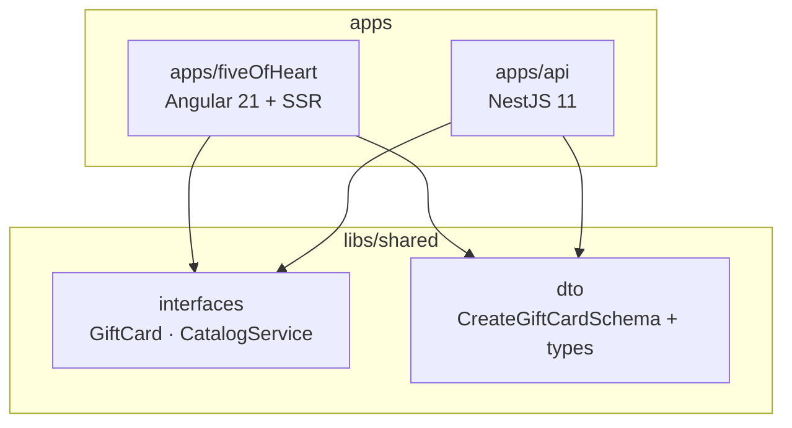
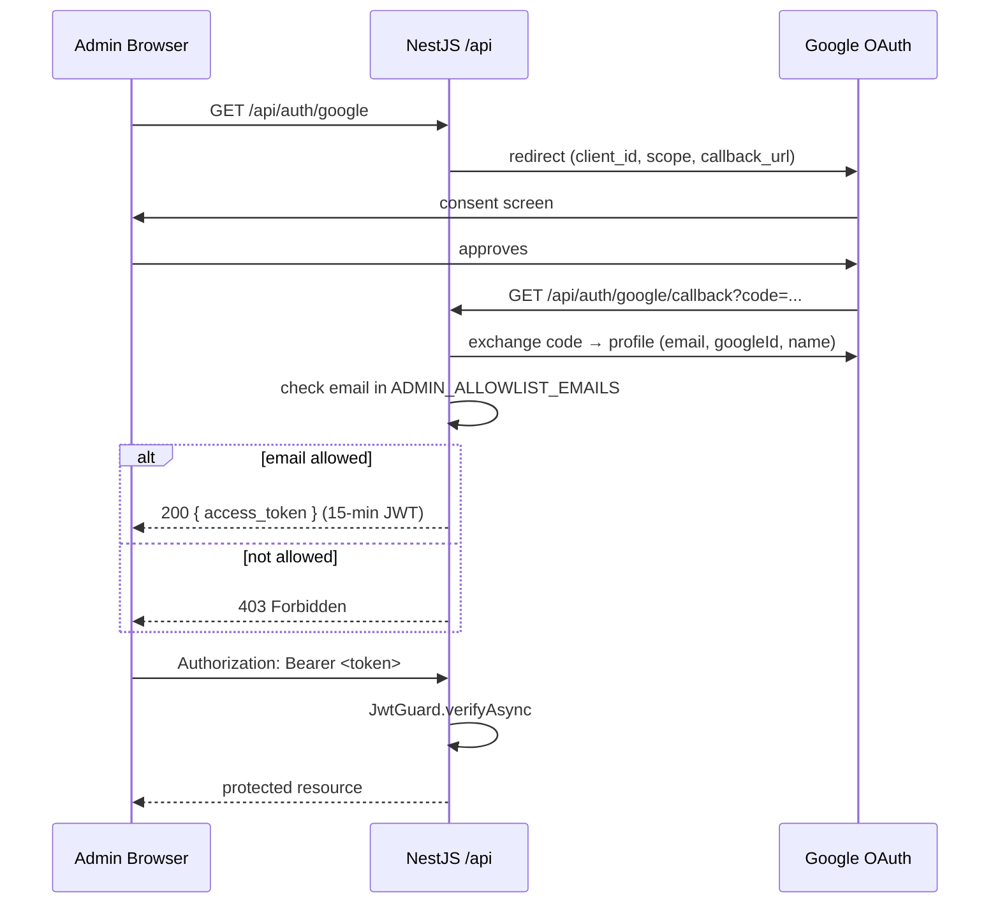
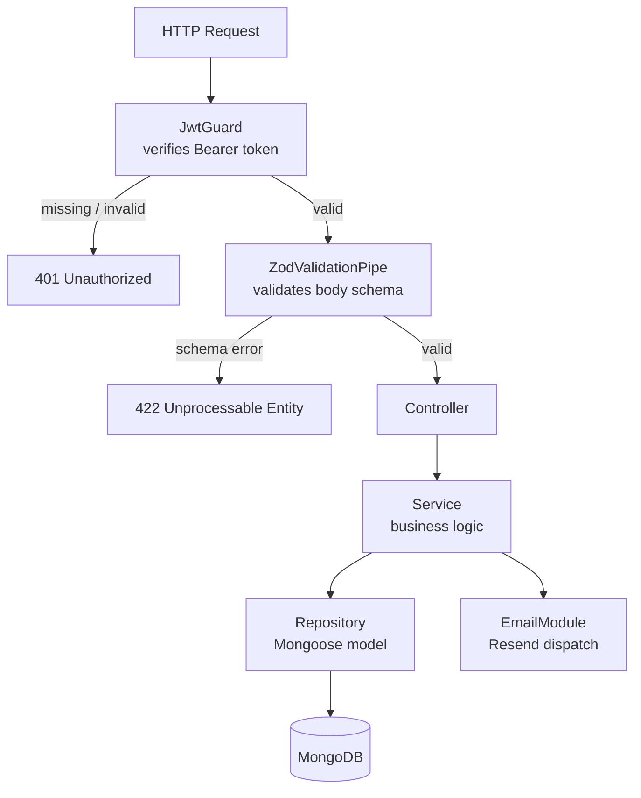

# feat: Integrate NestJS backend and migrate Angular to apps/fiveOfHeart structure

## Summary

Restructure the Nx workspace to a multi-project layout, migrate the Angular 21 SSR app to `apps/fiveOfHeart/`, scaffold a NestJS 11 modular-monolith at `apps/api/`, and implement Phase 1 of the gift-card backend: Google SSO admin auth, config-driven service catalog, gift card CRUD with Resend email delivery, and idempotent timestamped redemption. Shared Zod contracts in `libs/shared/` wire both apps to a single source of truth for types and validation.

---

## Problem Frame

The Angular app currently serves static data from `public/data/*.json` files fetched via `HttpClient`. Gift card management — creating personalized cards, delivering them by email, and tracking redemption — requires persistent storage, server-side logic, and a protected admin API. The Angular project lives at the workspace root with no `apps/` or `libs/` directories, making it impossible to register a NestJS app in the Nx project graph without restructuring first. (see origin: `docs/brainstorms/2026-05-30-backend-gift-cards-requirements.md`)

---

## Requirements

Carried from origin (R1–R24) with two overrides noted below.

**Workspace restructuring**

- R1. Angular app moves to `apps/fiveOfHeart/`; Nx project name `fiveOfHeart` is preserved.
- R2. All build, serve, test, and SSR targets verified after move (`npm exec nx build fiveOfHeart`, `npm exec nx serve fiveOfHeart`).
- R3. NestJS application scaffolded at `apps/api/`.
- R4. Nx project graph reflects `api` and `fiveOfHeart` as sibling projects, each with a dependency edge to `libs/shared/`.

**Shared contract layer**

- R5. `libs/shared/interfaces` exports `GiftCard` and `CatalogService` TypeScript interfaces. (`AdminUser` interface removed — admin auth uses env-var allowlist, no MongoDB user collection in Phase 1.)
- R6. `libs/shared/dto` exports `CreateGiftCardSchema` (Zod) with inferred TypeScript type. (`LoginSchema` removed — Google SSO replaces form-based login.)
- R7. Both apps import shared types exclusively from `libs/shared/*`.

**Backend — layered architecture**

- R8. Three-layer structure per NestJS module: controller → service → repository. Layers communicate downward only.
- R9. Each feature module self-contained; no cross-module direct class imports.
- R10. `EmailModule` is a shared provider imported by `GiftCardsModule`.

**Auth — Google SSO** _(overrides brainstorm R11–R14: local bcrypt auth replaced by Google OAuth)_

- R11. `AuthModule` implements Google OAuth 2.0 via `passport-google-oauth20`.
- R12. `GET /auth/google` initiates OAuth; `GET /auth/google/callback` exchanges code, verifies email against allowlist, and issues a signed JWT.
- R13. All gift-card endpoints require a valid JWT (`Authorization: Bearer`); unauthenticated requests receive 401.
- R14. Admin access is controlled by `ADMIN_ALLOWLIST_EMAILS` env var (comma-separated emails). No `AdminUser` MongoDB collection in Phase 1.

**Service catalog**

- R15. `catalog.config.ts` defines available services (id, title, price, currency, duration), seeded from `public/data/healthcare.json` shape.
- R16. `GET /catalog` returns the service list (public, no JWT required).
- R17. Gift card stores a service snapshot (name + price) at creation time; not coupled to a live catalog entry.

**Gift card domain — Phase 1**

- R18. Admin creates a gift card by selecting a service; card stores snapshot + recipient name, recipient email, sender name, optional personal message.
- R19. Each card receives a unique unguessable redemption code on creation.
- R20. Creation triggers a personalized Resend HTML email to the recipient.
- R21. Admin can list all gift cards with status and redemption timestamps.
- R22. Admin can mark a card redeemed (idempotent, stores `redeemedAt` timestamp).

**Phase 2 readiness**

- R23. `GiftCard` schema includes optional `paymentReference` field from day one.
- R24. `PaymentsModule` stub registered in `AppModule`.

---

## Key Technical Decisions

- **Google SSO via `passport-google-oauth20` + `@nestjs/jwt`.** Replaces brainstorm's local bcrypt/session auth. `@nestjs/passport` handles the OAuth strategy; after Google callback, `@nestjs/jwt` issues a 15-min JWT. No admin user database needed — auth is stateless from the backend's perspective in Phase 1.

- **Admin allowlist via `ADMIN_ALLOWLIST_EMAILS` env var.** Email verified on Google callback; non-listed emails receive 403. Simpler than a stored `AdminUser` collection and sufficient for a single-operator admin panel. Revisit when multi-operator role management is needed.

- **`apps/fiveOfHeart/` target path; project name `fiveOfHeart` preserved.** Overrides brainstorm's `apps/frontend/` decision. Preserving the name means all existing `buildTarget` references (e.g., `fiveOfHeart:build:production` in `serve` config) require no updates beyond correcting file paths.

- **`@nx/angular:move` as primary; manual move as fallback.** GitHub issue #16213 documents that this generator can fail when the project is at the workspace root. The plan tries the generator first (`--dry-run` first); if it fails, files are moved manually and `project.json` / tsconfig paths are updated by hand. Both paths produce the same outcome.

- **`tsconfig.base.json` extracted before any generator runs.** Current root `tsconfig.json` carries `moduleResolution: "bundler"` (Angular-specific). A `tsconfig.base.json` with shared settings (no `moduleResolution`) is created first; Angular keeps `"bundler"`, NestJS uses `"node16"`. Nx generators (`@nx/js:library`, `@nx/nest:application`) expect `tsconfig.base.json` for path alias registration.

- **`@nx/js:library --bundler=none` for shared libs.** Non-buildable — Angular and NestJS read source directly via TypeScript path aliases at `@five-of-heart/shared/interfaces` and `@five-of-heart/shared/dto`. No compilation step; correct for internal monorepo shared types.

- **`nestjs-zod` v5.4.0 for validation pipe.** `createZodDto` wraps Zod schemas into NestJS-compatible DTOs. A global `ZodValidationPipe` validates all request bodies; invalid input returns 422 with structured Zod error detail.

- **Custom `JwtGuard` for route protection; no `passport-jwt`.** `@nestjs/passport` is used only for the Google OAuth strategy. JWT verification uses a hand-written guard (reads `Authorization: Bearer`, calls `jwtService.verifyAsync`) — simpler than wiring a second Passport strategy.

- **Plain `resend` SDK wrapped in `EmailService`.** Avoids the `nest-resend` wrapper dependency. `EmailService` instantiates `new Resend(config.get('RESEND_API_KEY'))` and exposes `sendGiftCard(params)`. Throws on Resend API error — never swallowed.

- **`crypto.randomUUID()` for redemption codes.** Node 21+ built-in; v4 UUID. Unguessable, unique, no extra dependency. UUID collision probability is negligible in practice, but if a duplicate `code` hits the MongoDB unique index, Mongoose throws a duplicate-key error (code 11000) — `GiftCardsService.create` should surface this as a 500 (not a silent failure), which is acceptable for Phase 1.

- **Email dispatch is best-effort, not transactional.** `GiftCardsService.create` saves the card document first, then calls `emailService.sendGiftCard`. If email fails, the card record is persisted and the error is logged — the controller returns a 500 to the caller but the card exists in the database. Phase 1 admins can see the un-emailed card in the list and resend manually. A full transactional approach (outbox pattern or message queue) is Phase 2+ scope.

- **Package manager: npm.** `package-lock.json` is present; engines requires `npm >=10.9.3`. All commands use `npm install` / `npm exec nx`.

---

## High-Level Technical Design

### Workspace dependency graph



### Google SSO authentication flow



### Protected request lifecycle



---

## Output Structure

```
tsconfig.base.json              # new — shared compiler settings, path aliases
docker-compose.yml              # new — local MongoDB
.env.example                    # new — all required env vars documented

apps/
  fiveOfHeart/                  # moved from workspace root
    src/
    server.ts
    project.json
    tsconfig.json               # extends ../../tsconfig.base.json + moduleResolution: bundler
    tsconfig.app.json
    tsconfig.spec.json

  api/                          # new NestJS application
    src/
      main.ts
      app/
        app.module.ts
        app.controller.ts
      auth/
        auth.module.ts
        auth.service.ts
        auth.controller.ts
        guards/
          jwt.guard.ts
        strategies/
          google.strategy.ts
      catalog/
        catalog.config.ts
        catalog.module.ts
        catalog.service.ts
        catalog.controller.ts
      email/
        email.module.ts
        email.service.ts
      gift-cards/
        schemas/
          gift-card.schema.ts
        gift-cards.module.ts
        gift-cards.service.ts
        gift-cards.controller.ts
      payments/
        payments.module.ts
    project.json
    tsconfig.json               # extends ../../tsconfig.base.json + moduleResolution: node16
    tsconfig.app.json

libs/
  shared/
    interfaces/
      src/
        lib/
          gift-card.interface.ts
          catalog-service.interface.ts
        index.ts
      project.json
      tsconfig.json
    dto/
      src/
        lib/
          gift-card.dto.ts
        index.ts
      project.json
      tsconfig.json
```

---

## Implementation Units

### U1. Extract tsconfig.base.json

**Goal:** Create `tsconfig.base.json` with shared compiler settings (no `moduleResolution`); update root `tsconfig.json` to extend it and keep `moduleResolution: "bundler"`; update `tsconfig.app.json` and `tsconfig.spec.json`. This unblocks all subsequent generators.

**Requirements:** R1 (prerequisite), R3 (prerequisite)

**Dependencies:** none

**Files:**

- `tsconfig.base.json` (create)
- `tsconfig.json` (modify — extend `./tsconfig.base.json`, keep `moduleResolution: "bundler"` and Angular-specific fields)
- `tsconfig.app.json` (modify — change `extends` to `./tsconfig.base.json` if it currently extends `tsconfig.json` directly)
- `tsconfig.spec.json` (modify — same)

**Approach:** Move `strict`, `target`, `module`, `experimentalDecorators`, `emitDecoratorMetadata`, `esModuleInterop`, `isolatedModules`, and `useDefineForClassFields` to `tsconfig.base.json`. Keep `moduleResolution: "bundler"`, `lib`, and `skipLibCheck` in `tsconfig.json` (Angular-specific). `tsconfig.app.json` and `tsconfig.spec.json` each `extends` the root `tsconfig.json` (which in turn extends base) — no transitive changes needed. Nx generators will look for `tsconfig.base.json` at the workspace root to register path aliases; this unit creates it.

**Test scenarios:**

- `npm run lint:ts` (`tsc --noEmit`) exits 0 with no errors after the restructure.
- `npm exec nx build fiveOfHeart` exits 0 (Angular build unaffected).

**Verification:** Both commands exit 0; no import resolution regressions.

---

### U2. Migrate Angular app to apps/fiveOfHeart/

**Goal:** Relocate the Angular project from the workspace root into `apps/fiveOfHeart/`, update all path references, and verify every existing target still works. Nx project name `fiveOfHeart` is preserved.

**Requirements:** R1, R2

**Dependencies:** U1

**Files:**

- `apps/fiveOfHeart/` (new directory containing all moved Angular files)
- `apps/fiveOfHeart/project.json` (update `sourceRoot`, `outputPath`, `index`, `browser`, `tsConfig`, `server`, `ssr.entry`, `assets`, `styles` to `apps/fiveOfHeart/`-relative paths)
- `apps/fiveOfHeart/tsconfig.json` (extends `../../tsconfig.base.json`; add `moduleResolution: "bundler"`)
- `apps/fiveOfHeart/tsconfig.app.json` (update `files` to `./src/main.ts`, `./src/main.server.ts`, `./server.ts`)
- `apps/fiveOfHeart/tsconfig.spec.json`
- `apps/fiveOfHeart/server.ts` (update relative import `'./src/main.server'` → verify it resolves from new location)
- `package.json` script `serve:ssr:fiveOfHeart` path updated if `dist/` reference breaks
- Root-level Angular files removed after successful verification

**Approach:**

_Primary — generator:_

```bash
npm exec nx generate @nx/angular:move fiveOfHeart apps/fiveOfHeart --newProjectName=fiveOfHeart --dry-run
# if dry-run looks correct, remove --dry-run
```

_Fallback — manual (if generator fails on root project, per GitHub #16213):_

1. `mkdir -p apps/fiveOfHeart`
2. Move `src/`, `public/`, `server.ts`, `project.json`, `tsconfig.json`, `tsconfig.app.json`, `tsconfig.spec.json` into `apps/fiveOfHeart/`.
3. In `apps/fiveOfHeart/project.json`: set `"root": "apps/fiveOfHeart"`, `"sourceRoot": "apps/fiveOfHeart/src"`, update every path under `targets.build.options` to be relative to `apps/fiveOfHeart/` (e.g., `"outputPath": "dist/five-of-heart"`, `"index": "apps/fiveOfHeart/src/index.html"`, `"browser": "apps/fiveOfHeart/src/main.ts"`, `"server": "apps/fiveOfHeart/src/main.server.ts"`, `"ssr.entry": "apps/fiveOfHeart/server.ts"`, `"assets": [{"glob": "**/*", "input": "apps/fiveOfHeart/public"}]`, `"styles": ["apps/fiveOfHeart/src/styles.scss"]`).
4. In `apps/fiveOfHeart/tsconfig.json`: set `"extends": "../../tsconfig.base.json"`, add `"moduleResolution": "bundler"`.
5. Verify `migrations.json` at root — if it is Angular workspace migrations, move it to `apps/fiveOfHeart/`.
6. Verify `server.ts` `'(.*)'` catch-all route still works under Express v5 (Express 5 changed bare `'*'` to `'/{*path}'`, but regex-style `'(.*)'` string paths may need verification — test SSR render after move).

**Test scenarios:**

- `npm exec nx build fiveOfHeart` exits 0; output appears in `dist/five-of-heart/`.
- `npm exec nx serve fiveOfHeart` starts dev server on port 4200; Angular app loads in browser.
- `npm exec nx test fiveOfHeart` exits 0.
- SSR smoke test: `node dist/five-of-heart/server/server.mjs` starts without module resolution errors.
- `npm run lint:ts` exits 0 (no broken imports from the moved files).
- `npm run lint:prettier` exits 0 (no absolute paths introduced).

**Verification:** All six scenarios pass before U3/U4 begin.

---

### U3. Create shared contract libraries

**Goal:** Scaffold `libs/shared/interfaces` and `libs/shared/dto`; populate with domain interfaces and Zod schemas; verify path aliases resolve in both apps.

**Requirements:** R5, R6, R7

**Dependencies:** U1, U2

**Files:**

- `libs/shared/interfaces/src/lib/gift-card.interface.ts`
- `libs/shared/interfaces/src/lib/catalog-service.interface.ts`
- `libs/shared/interfaces/src/index.ts`
- `libs/shared/interfaces/project.json`
- `libs/shared/interfaces/tsconfig.json`
- `libs/shared/dto/src/lib/gift-card.dto.ts`
- `libs/shared/dto/src/index.ts`
- `libs/shared/dto/project.json`
- `libs/shared/dto/tsconfig.json`
- `libs/shared/dto/src/lib/gift-card.dto.spec.ts` (Zod schema validation tests)
- `tsconfig.base.json` (updated by generator with path aliases)
- `package.json` (`@nx/js` dev dep, `zod` prod dep)

**Approach:**

```bash
npm install -D @nx/js@22.7.4
npm install zod
npm exec nx generate @nx/js:library interfaces \
  --directory=libs/shared/interfaces \
  --bundler=none \
  --unitTestRunner=none \
  --importPath=@five-of-heart/shared/interfaces
npm exec nx generate @nx/js:library dto \
  --directory=libs/shared/dto \
  --bundler=none \
  --unitTestRunner=jest \
  --importPath=@five-of-heart/shared/dto
```

`GiftCard` interface: `_id: string`, `recipientName: string`, `recipientEmail: string`, `senderName: string`, `message?: string`, `serviceName: string`, `servicePrice: number`, `code: string`, `status: 'active' | 'redeemed'`, `redeemedAt?: Date`, `paymentReference?: string`, `createdAt: Date`, `updatedAt: Date`.

`CatalogService` interface: `id: string`, `title: string`, `price: number`, `currency: string`, `duration: { value: number; unitText: string }`.

`CreateGiftCardSchema` (Zod): `recipientName: z.string().min(1)`, `recipientEmail: z.string().email()`, `senderName: z.string().min(1)`, `serviceId: z.string().min(1)`, `message: z.string().max(500).optional()`.

Export `CreateGiftCardDto` via `createZodDto(CreateGiftCardSchema)` and inferred type `CreateGiftCardInput` via `z.infer<typeof CreateGiftCardSchema>`.

**Patterns to follow:** TypeScript interface style from `src/app/models/`; `createZodDto` pattern from `nestjs-zod` docs.

**Test scenarios:**

- `CreateGiftCardSchema.parse({ recipientName: 'Alice', recipientEmail: 'alice@example.com', senderName: 'Bob', serviceId: '1' })` succeeds (no optional message).
- `CreateGiftCardSchema.parse({ recipientEmail: 'not-an-email', recipientName: 'A', senderName: 'B', serviceId: '1' })` throws a Zod error containing `'recipientEmail'`.
- `CreateGiftCardSchema.parse({ ..., message: 'x'.repeat(501) })` throws a Zod error for `message`.
- Import `import { GiftCard } from '@five-of-heart/shared/interfaces'` compiles without error in a file under both `apps/fiveOfHeart` and `apps/api`.
- `npm exec nx build fiveOfHeart` still exits 0 after lib creation.

**Verification:** All schema tests pass; `npm run lint:ts` exits 0 for the full workspace.

---

### U4. Scaffold NestJS application

**Goal:** Install `@nx/nest` and NestJS core packages; scaffold `apps/api/`; configure `AppModule` with global `ZodValidationPipe`, CORS, `ConfigModule`, and `/api` prefix; verify health endpoint.

**Requirements:** R3, R4, R8, R9

**Dependencies:** U1, U3

**Files:**

- `apps/api/src/main.ts`
- `apps/api/src/app/app.module.ts`
- `apps/api/src/app/app.controller.ts` (health check)
- `apps/api/src/app/app.controller.spec.ts`
- `apps/api/project.json`
- `apps/api/tsconfig.json` (extends `../../tsconfig.base.json`, `moduleResolution: "node16"`)
- `apps/api/tsconfig.app.json`
- `package.json` (add `@nx/nest` dev, and `@nestjs/common`, `@nestjs/core`, `@nestjs/platform-express`, `@nestjs/config`, `reflect-metadata`, `rxjs`, `nestjs-zod`)

**Approach:**

```bash
npm install -D @nx/nest@22.7.4
npm exec nx generate @nx/nest:application api \
  --directory=apps/api \
  --unitTestRunner=jest \
  --e2eTestRunner=none \
  --strict \
  --frontendProject=fiveOfHeart
```

The `--frontendProject=fiveOfHeart` flag configures a dev proxy so `npm exec nx serve fiveOfHeart` can reach the NestJS API at port 3000 via `/api/*` without CORS issues in development.

In `main.ts`: enable CORS (`origin: process.env.FRONTEND_URL || 'http://localhost:4200'`), set global prefix `'api'`, register global `ZodValidationPipe` from `nestjs-zod`.

In `app.module.ts`: import `ConfigModule.forRoot({ isGlobal: true })`.

`app.controller.ts`: expose `GET /health` → returns `{ status: 'ok' }` (no auth).

**Test scenarios:**

- `npm exec nx build api` exits 0.
- `npm exec nx serve api` starts on port 3000 (or configured `PORT`).
- `GET /api/health` returns `200 { status: 'ok' }`.
- Sending a body with an invalid Zod schema to a test endpoint returns 422 with a structured error body (confirms `ZodValidationPipe` is active globally).
- `npm exec nx affected -t build` marks both `fiveOfHeart` and `api` affected when a file in `libs/shared/` changes.

**Verification:** Health endpoint responds; build exits 0; affected detection works.

---

### U5. MongoDB connection + local dev environment

**Goal:** Wire `@nestjs/mongoose` into `AppModule`; create `docker-compose.yml` for local MongoDB; document all env vars in `.env.example`.

**Requirements:** R8 (infrastructure), supports R11, R18

**Dependencies:** U4

**Files:**

- `apps/api/src/app/app.module.ts` (add `MongooseModule.forRootAsync`)
- `docker-compose.yml` (root — MongoDB 7 service)
- `.env.example` (root — all env vars documented)
- `package.json` (add `@nestjs/mongoose`, `mongoose`)

**Approach:**

```bash
npm install @nestjs/mongoose mongoose
```

`MongooseModule.forRootAsync` reads `MONGODB_URI` from `ConfigService`. Connection failure propagates as a startup error (default NestJS behaviour — no try/catch).

`docker-compose.yml`: `mongo:7` image, port `27017:27017`, named volume for data persistence, no auth for local dev.

`.env.example` — every env var consumed by U4–U10:

```
MONGODB_URI=mongodb://localhost:27017/take-my-energy
JWT_SECRET=change-me-in-production
GOOGLE_CLIENT_ID=
GOOGLE_CLIENT_SECRET=
GOOGLE_CALLBACK_URL=http://localhost:3000/api/auth/google/callback
ADMIN_ALLOWLIST_EMAILS=admin@example.com
RESEND_API_KEY=
EMAIL_FROM=noreply@takemyenergy.com
FRONTEND_URL=http://localhost:4200
PORT=3000
```

**Test scenarios:**

- With `docker-compose up -d`, `npm exec nx serve api` connects to MongoDB; logs show successful connection.
- With `MONGODB_URI` pointing to an unreachable host, startup fails with a clear connection error (not a silent hang).
- `.env.example` lists every env var used in the app; no var is consumed without appearing in the file.

**Verification:** App starts and Mongoose logs connection; `docker-compose down` does not leave orphaned containers.

---

### U6. AuthModule — Google SSO + JWT issuance

**Goal:** Google OAuth 2.0 via `passport-google-oauth20`; email allowlist verification; JWT issuance; `JwtGuard` for route protection.

**Requirements:** R11, R12, R13, R14

**Dependencies:** U4, U5

**Files:**

- `apps/api/src/auth/auth.module.ts`
- `apps/api/src/auth/auth.service.ts`
- `apps/api/src/auth/auth.service.spec.ts`
- `apps/api/src/auth/auth.controller.ts`
- `apps/api/src/auth/guards/jwt.guard.ts`
- `apps/api/src/auth/guards/jwt.guard.spec.ts`
- `apps/api/src/auth/strategies/google.strategy.ts`
- `package.json` (add `@nestjs/passport`, `passport`, `passport-google-oauth20`, `@types/passport-google-oauth20`, `@nestjs/jwt`)

**Approach:**

`GoogleStrategy` extends `PassportStrategy(Strategy, 'google')`. Constructor reads `GOOGLE_CLIENT_ID`, `GOOGLE_CLIENT_SECRET`, `GOOGLE_CALLBACK_URL` from `ConfigService`; scope: `['email', 'profile']`. `validate(accessToken, refreshToken, profile)` extracts `email`, `googleId`, `displayName` from the Google profile and returns them as a plain object.

`AuthService.handleGoogleCallback(email, googleId, name)`:

1. Read `ADMIN_ALLOWLIST_EMAILS` from `ConfigService`, split on `,`, trim each entry to a string, and convert each to lowercase.
2. If `email` is `undefined` or `null` (Google profile did not expose email) → throw `ForbiddenException` immediately without allowlist check.
3. If `email.toLowerCase()` not in the normalized list → throw `ForbiddenException('Email not authorized')`.
4. Sign JWT: payload `{ sub: googleId, email, name, role: 'admin' }`, expiry `'15m'`, using `JWT_SECRET`.
5. Return `{ access_token }`.

`AuthController`:

- `GET /auth/google` → `@UseGuards(AuthGuard('google'))` — Passport triggers Google redirect.
- `GET /auth/google/callback` → `@UseGuards(AuthGuard('google'))` → call `handleGoogleCallback` → return `{ access_token }` as JSON. (Phase 2: redirect to Angular admin with token when the admin UI exists.)

`JwtGuard` implements `CanActivate`:

1. Read `Authorization` header; if absent → throw `UnauthorizedException`.
2. Strip `Bearer ` prefix.
3. `await jwtService.verifyAsync(token)` — if throws → `UnauthorizedException('Invalid or expired token')`.
4. Attach payload to `request['user']`.

`AuthModule` imports `JwtModule.registerAsync` (reads `JWT_SECRET`, sets `signOptions: { expiresIn: '15m' }`). Exports `JwtGuard` and `AuthService` so other modules can import them.

**Patterns to follow:** NestJS guards pattern from research; `@nestjs/jwt` without Passport JWT strategy.

**Test scenarios:**

- `handleGoogleCallback` with an allowlisted email → returns object with `access_token` (unit test; mock `ConfigService` and `JwtService`).
- `handleGoogleCallback` with a non-allowlisted email → throws `ForbiddenException`.
- `handleGoogleCallback` with `email = undefined` (Google profile did not expose email) → throws `ForbiddenException` without attempting allowlist check on `undefined`.
- `ADMIN_ALLOWLIST_EMAILS` contains extra whitespace (`admin@example.com`) → email is trimmed before comparison; allowlisted email still passes.
- `ADMIN_ALLOWLIST_EMAILS` mixed casing → comparison is case-insensitive.
- `JwtGuard.canActivate` with a valid JWT → returns `true`; `request.user` is populated (unit test; mock `JwtService.verifyAsync`).
- `JwtGuard.canActivate` with no `Authorization` header → throws `UnauthorizedException`.
- `JwtGuard.canActivate` with expired/invalid token → `JwtService.verifyAsync` throws → guard throws `UnauthorizedException`.
- `GET /api/auth/google` → HTTP 302 redirect to `accounts.google.com` (e2e / manual).
- A protected route (`GET /api/gift-cards`) without JWT → 401 (integration with `JwtGuard` applied).

**Verification:** Unit tests pass; `GET /api/auth/google` redirects; a hand-issued test JWT grants access to a guarded route in a running local instance.

---

### U7. EmailModule — Resend integration

**Goal:** Injectable `EmailService` wrapping the `resend` SDK; HTML gift-card email template; exported from `EmailModule`.

**Requirements:** R10, R20

**Dependencies:** U4

**Files:**

- `apps/api/src/email/email.module.ts`
- `apps/api/src/email/email.service.ts`
- `apps/api/src/email/email.service.spec.ts`
- `package.json` (add `resend`)

**Approach:**

```bash
npm install resend
```

`EmailService` is an `@Injectable()`. Constructor: `private readonly resend = new Resend(this.config.get('RESEND_API_KEY'))`.

Expose one method:
`sendGiftCard({ to, recipientName, senderName, serviceName, price, currency, code, message?: string })`:

- Builds an HTML string: service name + price, sender name, optional personal message block, redemption code in a visually distinct box.
- Calls `this.resend.emails.send({ from: config.get('EMAIL_FROM'), to, subject: 'Your gift card from Take My Energy', html })`.
- If Resend returns an error, throws — do not swallow.

`EmailModule` exports `EmailService`.

**Note:** For initial testing, use a Resend-provided `@resend.dev` sender address to avoid domain verification. Production use requires verifying the domain in Resend's dashboard.

**Test scenarios:**

- `sendGiftCard` with all required fields → `resend.emails.send` called with correct `to`, `from`, `subject`, and `html` containing service name and code (unit test; mock `Resend` client).
- `message` provided → HTML contains the message text.
- `message` absent → HTML renders cleanly; no `'undefined'` string or empty `<p>` tag.
- Resend API returns an error object → `sendGiftCard` throws (not silently ignored).

**Verification:** Unit tests pass; `EMAIL_FROM` and `RESEND_API_KEY` read from `ConfigService`, not hardcoded.

---

### U8. CatalogModule — service catalog

**Goal:** Config-driven service list seeded from `public/data/healthcare.json` shape; `GET /catalog` endpoint (public); `CatalogModule` exported so `GiftCardsModule` can validate `serviceId`.

**Requirements:** R15, R16, R17

**Dependencies:** U4

**Files:**

- `apps/api/src/catalog/catalog.config.ts`
- `apps/api/src/catalog/catalog.module.ts`
- `apps/api/src/catalog/catalog.service.ts`
- `apps/api/src/catalog/catalog.controller.ts`
- `apps/api/src/catalog/catalog.controller.spec.ts`

**Approach:**

`catalog.config.ts` exports `CATALOG_SERVICES: CatalogService[]`. Populate from the real data in `public/data/healthcare.json` (confirmed to have `id`, `title`, `duration`, and per-office `products` with `price.value` + `price.currency`). Map each record to `CatalogService`: use the first office's price or a representative price as the canonical `price` field; note any price-per-office complexity in a comment.

`CatalogRegistryService` (the NestJS injectable — named to distinguish it from the `CatalogService` TypeScript interface in `libs/shared/interfaces`) exposes two methods:

- `findAll(): CatalogService[]` — returns `CATALOG_SERVICES` constant.
- `findById(id: string): CatalogService | undefined` — returns the matching entry or undefined.

`CatalogController`: `GET /catalog` — no `JwtGuard` (public endpoint). Returns the result of `findAll()`.

`CatalogModule` exports `CatalogRegistryService` — `GiftCardsModule` imports `CatalogModule` and calls `catalogRegistryService.findById(dto.serviceId)` during gift card creation.

**Test scenarios:**

- `GET /api/catalog` → 200, array of services with `id`, `title`, `price`, `currency`, `duration`.
- Response shape matches `CatalogService` from `@five-of-heart/shared/interfaces`.
- `GET /api/catalog` without a JWT → 200 (public endpoint, no 401).
- `CatalogRegistryService.findAll()` returns non-empty array (unit test against config constant).
- `CatalogRegistryService.findById('1')` returns the matching service.
- `CatalogRegistryService.findById('nonexistent')` returns `undefined`.

**Verification:** `GET /api/catalog` returns seeded data; types align with shared interface.

---

### U9. GiftCardsModule — CRUD, email trigger, redemption

**Goal:** Full gift-card lifecycle: create (service validation + email + unique code), list, get single, redeem (idempotent + timestamp).

**Requirements:** R17, R18, R19, R20, R21, R22, R23

**Dependencies:** U5, U6, U7, U8

**Files:**

- `apps/api/src/gift-cards/schemas/gift-card.schema.ts`
- `apps/api/src/gift-cards/gift-cards.module.ts`
- `apps/api/src/gift-cards/gift-cards.service.ts`
- `apps/api/src/gift-cards/gift-cards.service.spec.ts`
- `apps/api/src/gift-cards/gift-cards.controller.ts`
- `apps/api/src/gift-cards/gift-cards.controller.spec.ts`

**Approach:**

`GiftCard` Mongoose schema fields (all required unless noted):

- `recipientName: string`
- `recipientEmail: string`
- `senderName: string`
- `message: string` (optional)
- `serviceName: string` (snapshot)
- `servicePrice: number` (snapshot)
- `code: string` (unique index)
- `status: 'active' | 'redeemed'` (default `'active'`)
- `redeemedAt: Date` (optional)
- `paymentReference: string` (optional — R23, Phase 2 hook)
- `timestamps: true` (Mongoose adds `createdAt`, `updatedAt`)

`GiftCardsService.create(dto: CreateGiftCardInput)`:

1. Call `catalogRegistryService.findById(dto.serviceId)`.
2. If `undefined` → throw `NotFoundException('Service not found')`.
3. `code = crypto.randomUUID()`.
4. Save new document with service snapshot (`serviceName`, `servicePrice`).
5. Call `emailService.sendGiftCard(...)`.
6. Return saved document.

`GiftCardsService.redeem(id: string)`:

1. Find by `_id`; if not found → `NotFoundException`.
2. If `status === 'redeemed'` → return card unchanged (idempotent).
3. `findByIdAndUpdate(id, { status: 'redeemed', redeemedAt: new Date() }, { new: true })`.
4. Return updated document.

Controller — all routes decorated with `@UseGuards(JwtGuard)`:

- `POST /gift-cards` → `create`
- `GET /gift-cards` → `findAll`
- `GET /gift-cards/:id` → `findOne`
- `PATCH /gift-cards/:id/redeem` → `redeem`

**Test scenarios:**

- `POST /api/gift-cards` with valid DTO + valid `serviceId` → 201; response includes `code`, `status: 'active'`, `serviceName`, `servicePrice`; email dispatched (unit: mock `EmailService`).
- `POST` with `serviceId` not in catalog → 404.
- `POST` with invalid `recipientEmail` format → 422 (Zod pipe).
- `POST` with `message` longer than 500 chars → 422.
- `POST` where email dispatch fails (mock `EmailService.sendGiftCard` throws) → card IS saved in DB; controller returns 500; subsequent `GET /gift-cards` still shows the card (verifies best-effort email semantics).
- `GET /api/gift-cards` → 200, array.
- `GET /api/gift-cards/:id` with valid MongoDB ObjectId → 200 with full card detail.
- `GET /api/gift-cards/:nonexistent` → 404.
- `PATCH /api/gift-cards/:id/redeem` on an `active` card → 200; `status: 'redeemed'`; `redeemedAt` is set.
- `PATCH /api/gift-cards/:id/redeem` on an already-`redeemed` card → 200; `redeemedAt` unchanged; no second write (idempotency).
- All routes without JWT → 401.

**Verification:** Integration check with running MongoDB: create → list → redeem → re-redeem (verify `redeemedAt` unchanged on second call).

---

### U10. PaymentsModule stub

**Goal:** Declare `PaymentsModule` in the module graph to establish the Phase 2 dependency boundary before any implementation exists.

**Requirements:** R24

**Dependencies:** U4

**Files:**

- `apps/api/src/payments/payments.module.ts`
- `apps/api/src/app/app.module.ts` (add `PaymentsModule` import)

**Approach:** Minimal `@Module({})` class with no controllers, services, or providers. Imported into `AppModule` so it registers in the Nx project graph and is visible to `ce-plan` resume runs.

**Test scenarios:**

- `Test expectation: none — stub with no behavior; U4's build and health-check scenario covers app startup with PaymentsModule registered.`

**Verification:** `npm exec nx build api` exits 0 with `PaymentsModule` in `AppModule` imports.

---

## Scope Boundaries

### Deferred to Phase 2

- Payment integration (Stripe webhooks, `PaymentsModule` implementation)
- Public-facing gift card purchase form in Angular
- JWT refresh tokens (Phase 1 uses 15-min access tokens only)

### Outside Phase 1

- Admin Angular UI — Phase 1 API is exercised via REST client (Postman / curl / HTTPie)
- Gift card PDF attachments — Phase 1 email is HTML only
- Multi-currency or per-office pricing variations in the API
- Role-based access control beyond a single admin role
- Service catalog managed in MongoDB (prices updated by editing `catalog.config.ts`)

### Deferred to Follow-Up Work

- Update `.github/workflows/code-review.yml` to add `npm exec nx run-many -t build,test` for the two new projects
- Capture workspace restructuring learnings in `docs/solutions/` via `/ce-compound`

---

## Risks & Dependencies

- **`@nx/angular:move` root-project edge case** (GitHub #16213): The generator may fail when the project is at the workspace root. Manual fallback is documented in U2. Mitigation: always run with `--dry-run` first; fall back immediately if the generator errors without partial mutation.

- **Express v5 SSR catch-all**: `server.ts` uses `server.get('(.*)', ...)`. Express v5 changed bare `'*'` wildcard semantics (now `'/{*path}'`), but the regex-style `'(.*)'` string may behave differently. Verify the SSR catch-all renders Angular correctly after U2 migration before marking U2 complete.

- **Google OAuth callback URL registration**: `GOOGLE_CALLBACK_URL` must be added to the OAuth client's Authorised Redirect URIs in Google Cloud Console before the end-to-end auth flow can be tested. This is an external prerequisite for U6 E2E verification.

- **Resend domain verification**: Sending from a custom `EMAIL_FROM` domain requires the domain to be verified in Resend's dashboard. Use a `@resend.dev` sender address for initial testing to unblock U7 / U9 development.

- **`tsconfig.base.json` must precede generators**: If U1 is skipped or `tsconfig.base.json` is not present when `@nx/js:library` or `@nx/nest:application` generators run, they may register path aliases in `tsconfig.json` under the wrong key or fail. U1 is a hard prerequisite for U3 and U4.

- **npm workspace peer resolution**: `@nx/nest@22.7.4` must match the installed `nx` version (currently `22.7.4`). Installing a mismatched version may cause peer dependency conflicts or generator incompatibilities. Pin the version explicitly in the install command.

- **JWT token leakage via query parameter**: Phase 1 returns `{ access_token }` as a JSON body — safe, not exposed in URL or browser history. If Phase 2 switches to a redirect with `?token=...`, the token will appear in server logs, browser history, and referrer headers. Prefer HTTP-only cookie or fragment (`#token=...`) for the Phase 2 redirect shape.

- **Google OAuth CSRF state parameter**: `passport-google-oauth20` automatically generates and validates the `state` parameter, protecting against CSRF on the callback. No additional CSRF handling needed in `AuthController`.

- **Best-effort email and orphaned cards**: Cards saved without a successfully delivered email are not currently detectable from the API response (U9 returns 500 on email failure but the card persists). Phase 1 admins can find un-emailed cards via `GET /gift-cards` (no `emailSentAt` field to distinguish them). If this becomes a support burden, add an `emailSentAt: Date` optional field in a follow-up and set it only after successful dispatch.

---

## System-Wide Impact

- **Two separate Node.js processes in production**: Angular SSR (`apps/fiveOfHeart`) runs on port 4000 (or `PORT` env var); NestJS API (`apps/api`) runs on port 3000. In development, the `--frontendProject=fiveOfHeart` proxy handles cross-origin routing. In production, these must be placed behind a reverse proxy (nginx, Caddy, or equivalent) so the Angular app and API share a domain — e.g., `/` → Angular SSR, `/api/` → NestJS. Without this, browsers will block cross-origin API calls from the Angular frontend. The plan does not include reverse proxy setup; it is an operational prerequisite to document before production deployment.

- **CORS boundary**: `main.ts` enables CORS restricted to `FRONTEND_URL`. In production, `FRONTEND_URL` must match the exact origin of the Angular SSR app. Wildcard CORS (`*`) must not be used in production given that the API handles admin auth tokens.

- **Nx build cache boundary**: Changing any file in `libs/shared/` invalidates the build cache for both `apps/api` and `apps/fiveOfHeart`. This is intentional — shared type changes must propagate to both consumers — but it means shared lib changes are more expensive in CI than single-app changes. Keep `libs/shared/interfaces` and `libs/shared/dto` stable; add new fields rather than changing existing ones to minimize cross-app cache busting.

- **Angular SSR and API port separation**: The existing `server.ts` comment placeholder `// server.get('/api/**', ...)` suggests the original intent was to co-locate API routes in the SSR server. That approach is now explicitly rejected (see KTDs). The NestJS API and Angular SSR must run as separate processes; the placeholder comment in `apps/fiveOfHeart/server.ts` should be removed during U2 to avoid confusion.

---

## Open Questions

- **Google callback return shape**: Phase 1 returns `{ access_token }` as JSON (suitable for REST client testing). When the Angular admin UI lands in a later phase, the callback should use an HTTP-only cookie or URL fragment (not query parameter) to avoid leaking the JWT in server logs. The JSON shape is a known Phase 1 simplification.

---

## Sources & Research

- `@nx/angular:move` generator and root-project edge case: [GitHub #16213](https://github.com/nrwl/nx/issues/16213)
- `@nx/nest:application` generator: Nx 22.7.4, NestJS 11 support confirmed since Nx 21.2 release
- `@nx/js:library --bundler=none` for non-buildable shared type libs: Nx managed TS packages docs
- `nestjs-zod` v5.4.0: `createZodDto` + global `ZodValidationPipe`; supports Zod v3/v4/Zod Mini
- JWT auth without Passport JWT strategy: Trilon "NestJS Authentication Without Passport"
- `@nestjs/mongoose` schema pattern: `@Schema()` decorator + `HydratedDocument<T>` (Mongoose 8.x)
- Express v5 wildcard route change: `'*'` → `'/{*path}'`; regex string `'(.*)'` behaviour needs verification
- Service catalog data source: `public/data/healthcare.json` (not `src/app/data/services.data.ts`, which is a JSON-LD factory function)
- `crypto.randomUUID()`: available Node 21+; v4 UUID; no external dependency
