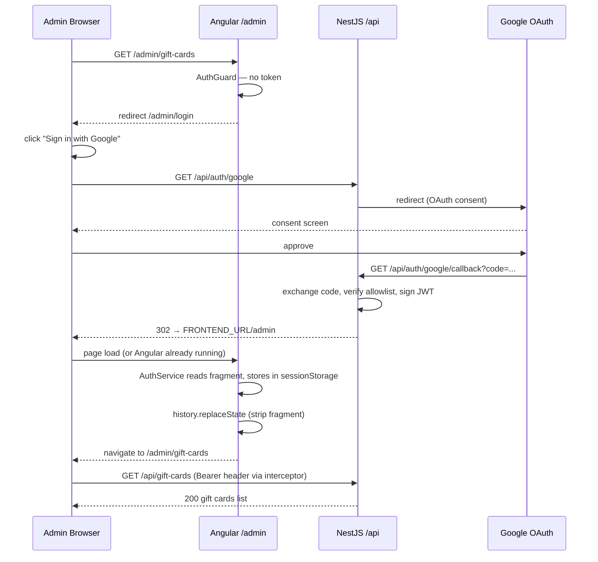
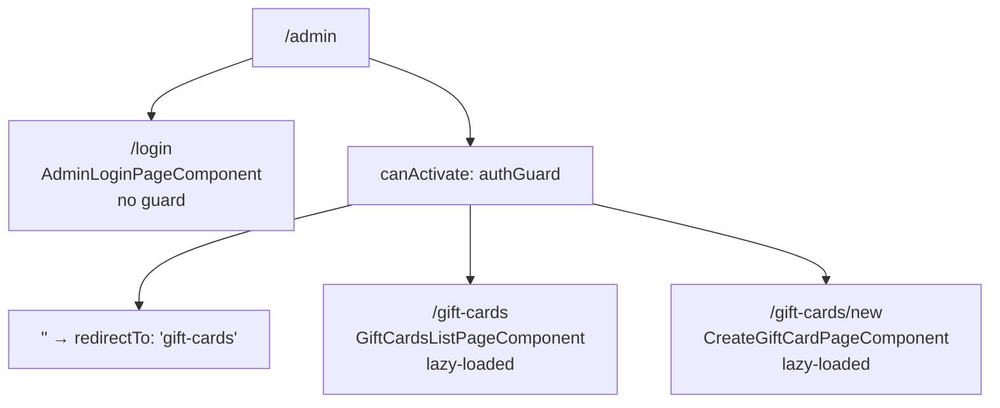

# feat: Admin gift card UI — Angular protected route with Google SSO

## Summary

Add a protected `/admin` section to the `apps/fiveOfHeart/` Angular app that authenticates via Google SSO and lets the operator create gift cards, view issued cards, and mark cards as redeemed. The backend API is already implemented; this plan wires the Angular frontend to it and makes the one backend change the auth flow requires (callback redirect instead of JSON response).

---

## Problem Frame

The backend gift card API (Phase 1 plan, U1–U10) is complete and exercisable via REST clients. The admin has no browser UI: creating a gift card requires constructing raw HTTP requests, and tracking redemptions requires manual API inspection. This plan closes that gap with a minimal but functional admin panel embedded in the existing Angular app, behind Google SSO.

---

## Requirements

- R1. A protected `/admin` section within `apps/fiveOfHeart/` — all routes under `/admin` except `/admin/login` require a valid JWT.
- R2. Auth flow: backend Google OAuth callback redirects to `FRONTEND_URL/admin#access_token=...` instead of returning JSON. Angular reads the fragment on load and stores the token in `sessionStorage`.
- R3. HTTP interceptor attaches `Authorization: Bearer <token>` to all `/api/*` requests automatically.
- R4. Any 401 response from the API clears the token and redirects to `/admin/login`.
- R5. Create gift card page — service selector (populated from `GET /api/catalog`), recipient name, recipient email, sender name, optional message (max 500 chars).
- R6. Gift cards list page — table of all issued cards with status, recipient info, service, price, dates.
- R7. Redeem action on the list page — calls `PATCH /api/gift-cards/:id/redeem`; idempotent (already-redeemed cards shown greyed out with no action button).
- R8. All `/admin/**` routes rendered client-side only — `sessionStorage` is unavailable server-side.
- R9. Dev proxy configuration forwards `/api/*` from the Angular dev server to `http://localhost:3000`.

---

## Key Technical Decisions

- **URL fragment for JWT delivery**: The backend callback redirects to `FRONTEND_URL/admin#access_token=...`. The fragment is never sent to the server and is not recorded in browser history after `history.replaceState`. HTTP-only cookie would be marginally more secure but requires same-domain deployment and `withCredentials: true` CORS config; fragment was chosen per brainstorm decision as the right Phase 1 trade-off.

- **`sessionStorage` over `localStorage`**: Token is scoped to the browser tab and clears on close. A single-operator admin panel does not benefit from persistent sessions.

- **Functional `HttpInterceptorFn` (Angular 21 style)**: Angular 21 uses `withInterceptors([authInterceptorFn])` in `provideHttpClient`. Avoids class-based interceptor boilerplate and aligns with the standalone component pattern already used in this project.

- **`RenderMode.Client` for `/admin/**`via`provideServerRoutesConfig`**: Admin pages read `sessionStorage`and trigger router navigation on auth state — neither is safe server-side. Adding the route to`provideServerRoutesConfig`in`app.config.server.ts`excludes all admin routes from SSR prerendering, preventing`sessionStorage is not defined` errors in SSR builds.

- **Shared types from `@five-of-heart/shared/interfaces` and `@five-of-heart/shared/dto`**: The Angular `tsconfig.json` already extends `../../tsconfig.base.json`, which registers both path aliases. Angular can import `GiftCard`, `CatalogService`, and `CreateGiftCardInput` directly — no type duplication. Only the TypeScript type (`CreateGiftCardInput`) is used on the Angular side, not the `CreateGiftCardDto` class, to avoid pulling NestJS-specific symbols into the browser bundle.

- **`proxy.conf.json` for dev only**: Angular dev server proxies `/api/*` to `http://localhost:3000`. Production traffic is routed by the infrastructure reverse proxy — no Angular-level proxy needed in production.

- **Remove dev file-write from `AuthController.googleCallback`**: The current controller writes `ACCESS_TOKEN` to `requests/.env.dev` in non-production mode. With the Angular admin UI as the primary consumer, this side effect should be removed. REST client testing can obtain the token from the browser's address bar after OAuth (token appears in the fragment briefly before `history.replaceState`).

---

## High-Level Technical Design

### Google SSO authentication flow



### Admin routing tree



---

## Output Structure

```
apps/
  fiveOfHeart/
    proxy.conf.json                                        ← new (U2)
    src/app/
      guards/
        auth.guard.ts                                      ← new (U3)
      interceptors/
        auth.interceptor.ts                                ← new (U3)
      services/
        auth.service.ts                                    ← new (U3)
        gift-cards-api.service.ts                          ← new (U5)
      pages/
        admin-page/
          admin-login-page.component.ts                    ← new (U4)
          admin-login-page.component.html                  ← new (U4)
          admin-login-page.component.scss                  ← new (U4)
          gift-cards/
            create/
              create-gift-card-page.component.ts           ← new (U6)
              create-gift-card-page.component.html         ← new (U6)
              create-gift-card-page.component.scss         ← new (U6)
            list/
              gift-cards-list-page.component.ts            ← new (U7)
              gift-cards-list-page.component.html          ← new (U7)
              gift-cards-list-page.component.scss          ← new (U7)
      app.config.ts                                        ← modified (U3)
      app.config.server.ts                                 ← modified (U4)
      app.routes.ts                                        ← modified (U4)
apps/
  api/
    src/auth/
      auth.controller.ts                                   ← modified (U1)
```

---

## Implementation Units

### U1. Backend: update `AuthController.googleCallback` to redirect with JWT fragment

**Goal:** Change the Google OAuth callback from returning `{ access_token }` as JSON to issuing a 302 redirect to `FRONTEND_URL/admin#access_token=<token>`. Remove the dev file-write side effect.

**Requirements:** R2

**Dependencies:** none

**Files:**

- `apps/api/src/auth/auth.controller.ts` (modify)

**Approach:** Inject `ConfigService` into `AuthController`. In `googleCallback`, call `handleGoogleCallback` as before to obtain `{ access_token }`. Build the redirect URL: `${config.get('FRONTEND_URL')}/admin#access_token=${result.access_token}`. Use `@Res() res: Response` from `express` and call `res.redirect(url)`. Remove the `fs.writeFileSync` dev-mode block and its `path`/`fs` imports. `FRONTEND_URL` is already present in `.env.example`.

**Patterns to follow:** `apps/api/src/auth/auth.service.ts` for `ConfigService` injection pattern.

**Test scenarios:**

- Allowlisted Google user completes OAuth → response is HTTP 302; `Location` header value contains `/admin#access_token=` (token is in the fragment, not a query parameter)
- Non-allowlisted email → `ForbiddenException` thrown (existing behavior unchanged)
- `FRONTEND_URL` env var is set to `http://localhost:4200` → `Location` is `http://localhost:4200/admin#access_token=...`
- Dev file-write side effect removed: controller no longer imports `fs` or `path`

**Verification:** Unit tests pass; `apps/api/src/auth/auth.controller.ts` contains no `fs` import; `npm exec nx test api` exits 0.

---

### U2. Dev proxy configuration for Angular → API

**Goal:** Forward `/api/*` requests from the Angular dev server to `http://localhost:3000` so the admin UI can call the API without CORS issues in development.

**Requirements:** R9

**Dependencies:** none

**Files:**

- `apps/fiveOfHeart/proxy.conf.json` (create)
- `apps/fiveOfHeart/project.json` (modify — add `proxyConfig` to `targets.serve.options`)

**Approach:** Create `proxy.conf.json` with a single rule: `"/api"` proxied to `"http://localhost:3000"` with `"changeOrigin": true`. In `project.json`, add `"proxyConfig": "apps/fiveOfHeart/proxy.conf.json"` under `targets.serve.options`. This is the manual equivalent of what `--frontendProject=fiveOfHeart` was intended to configure in the backend scaffolding.

**Test scenarios:**

- `Test expectation: none — verified manually.` With both `npm exec nx serve fiveOfHeart` and `npm exec nx serve api` running, `GET http://localhost:4200/api/health` returns `200 { status: 'ok' }`.

**Verification:** `proxy.conf.json` exists with correct rule; `project.json` references it; Angular dev server starts without error.

---

### U3. `AuthService`, HTTP interceptor, and `AuthGuard`

**Goal:** Read the JWT from the URL fragment after OAuth redirect; store it in `sessionStorage`; attach it to outgoing API requests via an interceptor; guard protected routes; handle 401 by clearing the token and redirecting to login.

**Requirements:** R1, R2, R3, R4, R8

**Dependencies:** none

**Files:**

- `apps/fiveOfHeart/src/app/services/auth.service.ts` (create)
- `apps/fiveOfHeart/src/app/interceptors/auth.interceptor.ts` (create)
- `apps/fiveOfHeart/src/app/guards/auth.guard.ts` (create)
- `apps/fiveOfHeart/src/app/app.config.ts` (modify — extend `provideHttpClient` with `withInterceptors([authInterceptorFn])`)

**Approach:**

`AuthService` is `providedIn: 'root'`. Constructor injects `Router` and `PLATFORM_ID`. All `sessionStorage` and `window` access is guarded by `isPlatformBrowser(platformId)`.

On construction (browser only):

1. If `window.location.hash` starts with `#access_token=`, extract the token value, write it to `sessionStorage` under key `'admin_token'`, and call `history.replaceState(null, '', window.location.pathname)` to strip the fragment before Angular Router resolves the URL.

Public methods:

- `getToken(): string | null` — returns `sessionStorage.getItem('admin_token')` (returns `null` on server)
- `isAuthenticated(): boolean` — `!!this.getToken()`
- `login(): void` — sets `window.location.href = '/api/auth/google'` (no-op on server)
- `logout(): void` — removes `'admin_token'` from `sessionStorage`, calls `this.router.navigate(['/admin/login'])`

`authInterceptorFn` (functional `HttpInterceptorFn`):

- Injects `AuthService` via `inject(AuthService)`.
- Passes through any request whose URL does not start with `/api/`.
- For `/api/*` requests: if a token exists, clone the request with `Authorization: Bearer <token>` header set.
- Pipes the `next` call through `catchError`: if the error is an `HttpErrorResponse` with `status === 401`, calls `authService.logout()` and re-throws the error. All other errors pass through unchanged.
- Registered in `app.config.ts` via `provideHttpClient(withFetch(), withInterceptors([authInterceptorFn]))`.

`authGuard` (functional `CanActivateFn`):

- Injects `AuthService` and `Router`.
- Returns `true` when `authService.isAuthenticated()`; otherwise returns `router.createUrlTree(['/admin/login'])`.

**Patterns to follow:** Existing `provideHttpClient(withFetch())` in `apps/fiveOfHeart/src/app/app.config.ts`; Angular 21 functional guard and interceptor conventions.

**Test scenarios:**

- Browser: `window.location.hash = '#access_token=mytoken'` before construction → `sessionStorage.getItem('admin_token')` equals `'mytoken'`; `window.location.hash` is empty after construction
- `isAuthenticated()` returns `true` when `sessionStorage` has `'admin_token'`; `false` when absent
- `logout()` removes `'admin_token'` from `sessionStorage` and navigates to `/admin/login`
- Interceptor: request to `/api/gift-cards` with a token → `Authorization: Bearer mytoken` header present on the cloned request
- Interceptor: request to `/api/gift-cards` without a token → no `Authorization` header
- Interceptor: request to an external URL (e.g., `https://fonts.googleapis.com/...`) → passes through unmodified (no header added)
- Interceptor: 401 response to `/api/*` → `logout()` called; error re-thrown
- Interceptor: 500 response to `/api/*` → `logout()` NOT called; error re-thrown
- `authGuard` with valid token → returns `true`
- `authGuard` without token → returns `UrlTree` pointing to `/admin/login`
- SSR: `AuthService` construction does not throw; `getToken()` returns `null`; no `sessionStorage` or `window` access attempted

**Verification:** Unit tests pass; `npm exec nx build fiveOfHeart` exits 0; `npm run lint:ts` exits 0.

---

### U4. Admin route setup, `provideServerRoutesConfig`, and login page

**Goal:** Wire `/admin/**` routes into the Angular router with the auth guard applied; configure client-side-only rendering for all admin routes; implement the login page.

**Requirements:** R1, R8

**Dependencies:** U3

**Files:**

- `apps/fiveOfHeart/src/app/app.routes.ts` (modify)
- `apps/fiveOfHeart/src/app/app.config.server.ts` (modify)
- `apps/fiveOfHeart/src/app/pages/admin-page/admin-login-page.component.ts` (create)
- `apps/fiveOfHeart/src/app/pages/admin-page/admin-login-page.component.html` (create)
- `apps/fiveOfHeart/src/app/pages/admin-page/admin-login-page.component.scss` (create)

**Approach:**

`app.routes.ts` — add the admin route group before the `**` wildcard:

```
{ path: 'admin', children: [
    { path: 'login', component: AdminLoginPageComponent },
    { path: '', canActivate: [authGuard], children: [
        { path: 'gift-cards/new', loadComponent: () => CreateGiftCardPageComponent },
        { path: 'gift-cards',     loadComponent: () => GiftCardsListPageComponent },
        { path: '',               redirectTo: 'gift-cards', pathMatch: 'full' },
    ]},
]}
```

`app.config.server.ts` — import `provideServerRoutesConfig` and `RenderMode` from `@angular/ssr`; add `provideServerRoutesConfig([{ path: 'admin/**', renderMode: RenderMode.Client }])` to the `serverConfig` providers. This prevents SSR from prerendering any admin route.

`AdminLoginPageComponent` (standalone):

- `ngOnInit`: if `authService.isAuthenticated()`, navigate to `/admin/gift-cards`.
- Template: centered card with heading "Admin Panel" and a `<button>` labeled "Sign in with Google" that calls `authService.login()`.
- Styling uses the existing CSS variable system (`--c-brand`, `--c-cta`, `--c-bg-card`) — no new design tokens.

**Patterns to follow:** Existing lazy-loaded route declarations in `apps/fiveOfHeart/src/app/app.routes.ts`; existing page component structure under `pages/`.

**Test scenarios:**

- Unauthenticated navigation to `/admin/gift-cards` → `authGuard` redirects to `/admin/login`
- Unauthenticated navigation to `/admin` → redirectTo resolves to `gift-cards` → `authGuard` redirects to `/admin/login`
- Authenticated navigation to `/admin/login` → `ngOnInit` redirects to `/admin/gift-cards`
- Login page renders a button with "Sign in with Google" text
- Button click calls `authService.login()` (sets `window.location.href = '/api/auth/google'`)
- SSR build: `npm exec nx build fiveOfHeart` exits 0 with no `sessionStorage` errors in the build log

**Verification:** `npm exec nx build fiveOfHeart` exits 0; manual smoke test confirms unauthenticated requests redirect to login.

---

### U5. `GiftCardsApiService`

**Goal:** Typed HTTP client wrapper for all gift card and catalog endpoints.

**Requirements:** R5, R6, R7

**Dependencies:** none

**Files:**

- `apps/fiveOfHeart/src/app/services/gift-cards-api.service.ts` (create)

**Approach:** `@Injectable({ providedIn: 'root' })` with `HttpClient` constructor injection. All methods return Observables typed against the shared interfaces. Use `GiftCard` and `CatalogService` from `@five-of-heart/shared/interfaces` and `CreateGiftCardInput` (the `z.infer<>` type, not the DTO class) from `@five-of-heart/shared/dto`.

Methods:

- `getCatalog(): Observable<CatalogService[]>` → `GET /api/catalog`
- `createGiftCard(dto: CreateGiftCardInput): Observable<GiftCard>` → `POST /api/gift-cards`
- `listGiftCards(): Observable<GiftCard[]>` → `GET /api/gift-cards`
- `redeemGiftCard(id: string): Observable<GiftCard>` → `PATCH /api/gift-cards/${id}/redeem`

Error handling is left to calling components. The auth interceptor handles 401 globally.

**Patterns to follow:** `apps/fiveOfHeart/src/app/services/healthcare.service.ts` for `HttpClient` + Observable pattern.

**Test scenarios:**

- `getCatalog()` makes a `GET` to `/api/catalog` and maps the response to `CatalogService[]`
- `createGiftCard(dto)` makes a `POST` to `/api/gift-cards` with `dto` as the body; response mapped to `GiftCard`
- `listGiftCards()` makes a `GET` to `/api/gift-cards`; response mapped to `GiftCard[]`
- `redeemGiftCard('abc123')` makes a `PATCH` to `/api/gift-cards/abc123/redeem`; response mapped to `GiftCard`

**Verification:** Unit tests using `HttpTestingController` pass; `npm run lint:ts` exits 0.

---

### U6. Create gift card page

**Goal:** Reactive form for creating a gift card — loads the service catalog, validates inputs, and submits to `POST /api/gift-cards`.

**Requirements:** R5

**Dependencies:** U4, U5

**Files:**

- `apps/fiveOfHeart/src/app/pages/admin-page/gift-cards/create/create-gift-card-page.component.ts` (create)
- `apps/fiveOfHeart/src/app/pages/admin-page/gift-cards/create/create-gift-card-page.component.html` (create)
- `apps/fiveOfHeart/src/app/pages/admin-page/gift-cards/create/create-gift-card-page.component.scss` (create)

**Approach:** Standalone Angular 21 component using `ReactiveFormsModule`.

Form controls:

- `serviceId` — `Validators.required`; rendered as `<select>` populated from `getCatalog()` on init; each option label: `${service.title} — ${service.price} ${service.currency}`
- `recipientName` — `Validators.required`
- `recipientEmail` — `Validators.required, Validators.email`
- `senderName` — `Validators.required`
- `message` — optional, `Validators.maxLength(500)`; display live character counter below the textarea

Submit behavior:

- Submit button disabled when `form.invalid || submitting`
- On submit: set `submitting = true`, call `GiftCardsApiService.createGiftCard(form.value as CreateGiftCardInput)`
- On success: navigate to `/admin/gift-cards?created=true`
- On error: set `errorMessage`, reset `submitting = false`

Catalog state: local `catalog` signal initialized by `ngOnInit`. If catalog load fails, render an inline error state with a retry option.

Styling follows the existing CSS variable system; no new design tokens.

**Patterns to follow:** Angular 21 reactive forms with standalone imports; existing SCSS variable usage in `apps/fiveOfHeart/src/styles.scss`.

**Test scenarios:**

- All required fields valid + valid service selected → submit button enabled; successful submit navigates to `/admin/gift-cards?created=true`
- Any required field empty → submit button disabled
- `recipientEmail` set to `"not-an-email"` → email validation error shown; submit disabled
- `message` length > 500 chars → maxlength error shown; submit disabled
- `submitting = true` (in-progress) → submit button disabled, preventing double-submit
- API returns 422 → `errorMessage` set; `submitting` resets to `false`; form remains usable
- API returns 500 → same behavior as 422
- Catalog `GET /api/catalog` fails → error state rendered; component does not throw
- Catalog loads with three services → `<select>` renders three options with correct labels

**Verification:** Unit tests pass; form renders and submits successfully in a running dev environment.

---

### U7. Gift cards list page with redeem action

**Goal:** Display all issued gift cards in a table; allow redeeming active cards inline; show a success banner when navigated from the create page.

**Requirements:** R6, R7

**Dependencies:** U4, U5

**Files:**

- `apps/fiveOfHeart/src/app/pages/admin-page/gift-cards/list/gift-cards-list-page.component.ts` (create)
- `apps/fiveOfHeart/src/app/pages/admin-page/gift-cards/list/gift-cards-list-page.component.html` (create)
- `apps/fiveOfHeart/src/app/pages/admin-page/gift-cards/list/gift-cards-list-page.component.scss` (create)

**Approach:** Standalone component. `ngOnInit` calls `GiftCardsApiService.listGiftCards()` and stores results in a local `cards` signal.

Table columns: truncated code (full value on hover), recipient name, recipient email, service name, price, status badge (`active` / `redeemed` with distinct CSS variable colors), created date, redeemed date (dash if null).

Redeem action:

- Active cards show a "Redeem" button; redeemed cards show no button.
- On click: disable the specific card's button (track by card `_id` in a `redeeming` Set), call `redeemGiftCard(card._id)`.
- On success: replace that card in the `cards` array with the updated card returned by the API.
- On error: show inline row-level error message; re-enable the button.

Empty state: "No gift cards yet" message with a link to `/admin/gift-cards/new`.

Success banner: read `ActivatedRoute.snapshot.queryParams['created']`; if `'true'`, display a dismissable banner ("Gift card created — email sent to recipient."). Banner can be dismissed manually or auto-dismissed after 5 seconds.

"Create New" navigation button in the page header.

**Test scenarios:**

- `ngOnInit` calls `listGiftCards()`; returned cards rendered as table rows
- Active card row has a "Redeem" button; redeemed card row has no "Redeem" button
- "Redeem" clicked: button disabled while PATCH in flight; on success, card in table updates to `status: 'redeemed'` and `redeemedAt` shows the timestamp
- Second "Redeem" on already-redeemed card: backend returns idempotent 200; table reflects redeemed state (no regression)
- PATCH error: row-level error message shown; button re-enabled
- `listGiftCards()` returns empty array → empty state rendered with "Create one" link
- `listGiftCards()` fails → error state rendered; component does not throw
- Navigation with `?created=true` → success banner visible
- Navigation without `?created=true` → no banner

**Verification:** Unit tests pass; end-to-end: create a gift card → confirm list shows it as active → redeem it → confirm status updates in the table.

---

## Scope Boundaries

### Outside this plan

- Token refresh or persistent sessions across browser closes (no refresh tokens in Phase 1)
- Gift card detail / single-card view page
- Resend email action from the admin UI (Phase 2+)
- Admin UI for browsing or editing the service catalog
- Role-based access control beyond the single-admin JWT
- Production reverse proxy or deployment documentation

### Deferred to Follow-Up Work

- Update `docs/requests/README.md` to document manual token retrieval via the browser fragment after U1 removes the dev file-write — REST client workflows need to adapt
- Fix TypeScript diagnostic in `apps/api/src/gift-cards/gift-cards.controller.spec.ts` (lines 124, 130): `ObjectId` not assignable to `string` in test cast — unrelated to this plan but currently reported by the IDE

---

## Risks & Dependencies

- **`provideServerRoutesConfig` / `RenderMode` API availability**: These symbols live in `@angular/ssr` and were introduced in Angular 19. If the installed Angular version predates them, the import will fail at build time. Verify the import resolves before committing U4. Fallback: exclude admin routes from prerendering by listing them in the `"routes"` configuration in `angular.json` instead.

- **`history.replaceState` / Angular Router race**: `AuthService` reads the fragment in its constructor, which fires before Angular Router processes the URL. This ordering is safe because service constructors run during dependency injection, before route activation. Verify in a browser test that the fragment is read and stripped before Angular navigation activates.

- **Shared lib import pulling NestJS symbols into the browser bundle**: `@five-of-heart/shared/dto` re-exports from `nestjs-zod`. Using only the `CreateGiftCardInput` TypeScript type (erased at compile time) avoids this. If `npm exec nx build fiveOfHeart` fails with a `nestjs-zod` or NestJS-related import error, switch to a locally duplicated plain TypeScript type in `apps/fiveOfHeart/` that mirrors `CreateGiftCardInput`.

- **`ConfigService` injection in `AuthController`**: `AuthController` does not currently inject `ConfigService`. `ConfigModule.isGlobal: true` is set in `AppModule`, so `ConfigService` is available anywhere — but verify after U1 that `AuthModule` providers list does not conflict with this global registration.

- **SSR prerender fallback if `RenderMode.Client` is unavailable**: Without the render mode exclusion, the SSR build may prerender `/admin/**` routes and throw `sessionStorage is not defined`. The `isPlatformBrowser` guards in `AuthService` prevent crashes, but the prerender output will be a broken page. If `provideServerRoutesConfig` is unavailable, add a `typeof sessionStorage !== 'undefined'` guard to every storage call as a defense-in-depth measure.

---

## Sources & Research

- Angular 21 functional interceptors: `withInterceptors` in `provideHttpClient` — replaces class-based `HTTP_INTERCEPTORS` multi-provider pattern
- Angular `provideServerRoutesConfig` / `RenderMode.Client`: `@angular/ssr` `ServerRoute` API, introduced Angular 19, available in v21
- `history.replaceState` for stripping URL fragments: standard Web History API, no Angular-specific behavior
- Existing backend plan: `docs/plans/2026-05-30-001-feat-nestjs-backend-gift-cards-plan.md` (U6 `AuthModule`, U9 `GiftCardsModule`, U8 `CatalogModule`)
- Shared type path aliases: `tsconfig.base.json` registers `@five-of-heart/shared/interfaces` and `@five-of-heart/shared/dto`; Angular `tsconfig.json` extends it
- Brainstorm decisions: protected `/admin` route in `fiveOfHeart`, URL fragment auth flow, `sessionStorage`, all three admin features in scope
