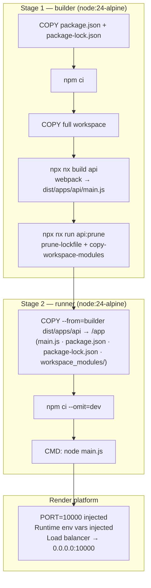

# feat: Add Dockerfile and render.yaml for API deployment on Render

## Summary

Create a multi-stage `Dockerfile` that builds and packages the NestJS API inside Docker, a `.dockerignore` to keep the build context lean, a `render.yaml` infrastructure definition for version-controlled Render configuration, and a minor `main.ts` fix to bind explicitly to `0.0.0.0` as required by Render's load balancer.

---

## Problem Frame

The NestJS API at `apps/api/` runs locally via `nx serve api` but has no containerized deployment path. Render's Docker runtime expects a `Dockerfile` that produces a runnable image — Render builds the image on each deploy, injects `PORT`, and routes traffic through its load balancer. Without an explicit `0.0.0.0` binding the app is unreachable inside the container. Without a `render.yaml` the service configuration lives only in the Render dashboard and is not version-controlled alongside the code.

---

## Requirements

**Build and packaging**

- R1. A multi-stage `Dockerfile` at the repo root builds the NestJS API in a builder stage using the existing Nx webpack build, then produces a slim runtime image containing only the pruned production dependencies and the compiled output.
- R2. The Docker build context is the repo root (the Nx workspace requires access to the full monorepo during build).
- R3. The runtime image uses Node 24 Alpine to match the project's `engines.node >= 24` constraint.
- R4. A `.dockerignore` at the repo root excludes `node_modules`, `dist`, `.nx`, `.angular`, `.git`, secrets, and `.env` files from the build context.

**Runtime behavior**

- R5. The app binds to `0.0.0.0` so Render's load balancer can reach it.
- R6. The app reads its port from `process.env.PORT`; Render injects `PORT=10000` at runtime.
- R7. No secrets or environment variable values are baked into the Docker image; all runtime configuration is injected via Render's environment at container start.

**Render configuration**

- R8. A `render.yaml` at the repo root declares the web service with `runtime: docker`, pointing to the `Dockerfile` and the repo root as the build context.
- R9. All secrets (MongoDB URI, JWT secret, Google OAuth credentials, Resend API key) use `sync: false` in `render.yaml` so their values are set in the Render dashboard and never committed to the repo.
- R10. `render.yaml` includes a `buildFilter` so Render only triggers a new build when files relevant to the API change (not frontend-only changes).

---

## Key Technical Decisions

- **Multi-stage build using Nx prune targets**: The builder stage runs `npx nx build api` (webpack bundle into `dist/apps/api/`) followed by `npx nx run api:prune` (which runs `prune-lockfile` + `copy-workspace-modules` in sequence). This produces a `package.json` and `package-lock.json` scoped to actual runtime dependencies, plus a `workspace_modules/` directory with any local libs. The runtime stage copies only `dist/apps/api/`, runs `npm ci --omit=dev`, and starts `node main.js`. This avoids shipping the full 1.2 GB monorepo `node_modules` into the image.

- **`NX_DAEMON=false` in the builder stage**: The Nx daemon is a background process that provides project-graph caching for the local dev experience. Inside Docker there is no running daemon and no socket to connect to; setting `NX_DAEMON=false` prevents Nx from timing out waiting for a daemon connection and falls back cleanly to in-process graph resolution.

- **`render.yaml` secrets use `sync: false` (not `generateValue`)**: All sensitive values (JWT secret, OAuth credentials, DB URI) are operator-supplied, not generated. `sync: false` tells Render to expect the value to be set manually in the dashboard — it omits the field from the YAML so the secret never touches version control, while still appearing in the service's environment variable list.

- **Dockerfile at repo root, not `apps/api/`**: The Nx build toolchain resolves workspace package paths relative to the root. Placing the Dockerfile at the root and using `.` as the Docker context gives the builder stage access to the full monorepo without any path rewriting.

- **`0.0.0.0` binding explicitly in `main.ts`**: NestJS's `app.listen(port)` with no host argument resolves to the OS default, which in some container configurations maps to `127.0.0.1`. Render's docs explicitly require `0.0.0.0`. Passing `'0.0.0.0'` as the second argument to `app.listen()` is the safe, portable fix.

---

## High-Level Technical Design

---

## Implementation Units

### U1. Create `.dockerignore`

**Goal:** Exclude large, irrelevant, or sensitive directories from the Docker build context so the build is fast and no secrets reach the image.

**Requirements:** R4, R7

**Dependencies:** none

**Files:**

- `.dockerignore` _(create)_

**Approach:** Exclude `node_modules` and `dist` (rebuilt inside Docker), `.nx` and `.angular` (caches), `.git` and `.github`, `.husky`, `docs`, `requests/`, `secrets/`, all `.env` and `.env.*` files, and common log/temp patterns. The `apps/fiveOfHeart/` frontend source is large but needed in context since `COPY . .` must include `package.json` and any shared `libs/` — so exclude only the frontend's compiled artifacts (`.angular/`), not the source.

**Test scenarios:**

- Test expectation: none — `.dockerignore` has no runtime behavior to assert. Verified by the `docker build` in U2 completing without sending `node_modules/` in the context (visible from build output "Sending build context" size being reasonable).

**Verification:** `docker build` in U2 succeeds without timing out on context upload; no `.env` values appear in the image.

---

### U2. Create multi-stage `Dockerfile`

**Goal:** Produce a runnable, minimal Docker image for the NestJS API using a two-stage build that isolates build tooling from the production runtime.

**Requirements:** R1, R2, R3, R6, R7

**Dependencies:** U1

**Files:**

- `Dockerfile` _(create)_

**Approach:**

Builder stage (`node:24-alpine AS builder`):

- Set `NX_DAEMON=false` to prevent daemon connection attempts
- Copy `package.json` and `package-lock.json` first (layer cache: deps only reinstall when the lockfile changes)
- Run `npm ci` to install all workspace dependencies
- Copy the full workspace (`COPY . .`)
- Run `npx nx build api` (webpack, production mode by default per `project.json`)
- Run `npx nx run api:prune` to generate the pruned lockfile and copy workspace modules

Runtime stage (`node:24-alpine AS runner`):

- Set `NODE_ENV=production`
- Copy `dist/apps/api/` into `/app` — this includes `main.js`, `package.json`, `package-lock.json`, and `workspace_modules/`
- Run `npm ci --omit=dev` to install only production dependencies using the pruned lockfile
- `EXPOSE 10000` (advisory; Render detects the port from `PORT` env var)
- `CMD ["node", "main.js"]`

**Patterns to follow:** Nx's own `setup-docker` generator template at `node_modules/@nx/node/src/generators/setup-docker/files/Dockerfile__tmpl__` (used as reference; the multi-stage approach here extends its pattern with a dedicated builder stage).

**Test scenarios:**

- Happy path: `docker build -t take-my-energy-api .` completes without error; `docker run -e PORT=10000 -e MONGODB_URI=<test-uri> … -p 10000:10000 take-my-energy-api` starts the server and `curl http://localhost:10000/api` returns a response (not a connection refused).
- Build cache: Running `docker build` a second time without code changes reuses all layers from the dependency install step onward.
- No secrets in image: Inspecting the image with `docker history take-my-energy-api` shows no env var values baked in beyond `NODE_ENV=production`.

**Verification:** Image builds cleanly, the container starts and the API is reachable on the configured port.

---

### U3. Bind API to `0.0.0.0` in `main.ts`

**Goal:** Ensure the NestJS app listens on all network interfaces so Render's load balancer can route traffic to the container.

**Requirements:** R5, R6

**Dependencies:** none

**Files:**

- `apps/api/src/main.ts` _(modify)_

**Approach:** Change `app.listen(port)` to `app.listen(port, '0.0.0.0')`. No other changes. The `port` variable already reads from `process.env['PORT'] || 3000`, so Render's injected `PORT=10000` is respected automatically.

**Test scenarios:**

- Happy path: In the Docker container from U2, the process binds on `0.0.0.0:10000` (visible in startup log or via `ss -tlnp`); requests from outside the container succeed.
- Local dev unchanged: Running `nx serve api` locally still starts on port 3000 and is reachable on `localhost:3000/api`.

**Verification:** `docker run … take-my-energy-api` logs `Application running on http://localhost:10000/api`; `curl` from the host succeeds.

---

### U4. Create `render.yaml`

**Goal:** Version-control the Render service definition so the deployment configuration is reproducible and reviewable alongside the code.

**Requirements:** R8, R9, R10

**Dependencies:** U2 (Dockerfile must exist for the `dockerfilePath` reference to be valid)

**Files:**

- `render.yaml` _(create)_

**Approach:**

- `type: web`, `runtime: docker` — Render builds from the `Dockerfile`
- `dockerfilePath: ./Dockerfile`, `dockerContext: .` — root Dockerfile, full repo context
- `buildFilter.paths` — include `apps/api/**`, `libs/**`, `package.json`, `package-lock.json`, `Dockerfile`, `.dockerignore`; exclude frontend paths so Angular-only changes do not trigger an API redeploy
- `plan: starter` — the lowest paid tier (upgrade in the dashboard for auto-sleep-free behavior); the `free` tier sleeps after inactivity
- `envVars`: set `NODE_ENV=production` as a plain value; all other vars from `.env.example` use `sync: false` so values are entered in the Render dashboard and never committed

**Patterns to follow:** Render Blueprint Spec (see Sources); `sync: false` is the required pattern for any credential that must not appear in version control.

**Test scenarios:**

- Test expectation: none — `render.yaml` is declarative config with no executable logic. Verified manually by connecting the repo in the Render dashboard, confirming the service is detected from `render.yaml`, and confirming the env var fields appear as "not synced" (prompting for values).

**Verification:** The Render dashboard detects the `render.yaml` blueprint on first connection; all secret env vars show as unset/awaiting values rather than pre-filled.

---

## Scope Boundaries

### Deferred to Follow-Up Work

- **Health check endpoint** — `render.yaml` omits `healthCheckPath` because the API has no `/health` route. Adding `GET /api/health` (returning `{ status: "ok" }`) would enable Render's HTTP health probe for faster zero-downtime deploys.
- **Autoscaling** — `render.yaml` uses a fixed `numInstances: 1`. Scaling configuration (`scaling.minInstances`, `scaling.targetCPUPercent`) requires a Pro plan and is left for when traffic warrants it.
- **Preview environments** — `previews.generation: automatic` would spin up isolated environments per PR; deferred until the team adopts PR-based review workflows.

### Out of scope

- Dockerizing or deploying the Angular frontend (`apps/fiveOfHeart/`) — it is already deployed to Vercel via `vercel.json`.
- MongoDB hosting — the API connects to an external MongoDB instance (Atlas or similar); no database infrastructure is provisioned here.
- CI/CD pipeline changes — no GitHub Actions workflow is added; Render's own build trigger from `render.yaml` handles deploys on push.

---

## Risks & Dependencies

- **Nx workspace in Docker build time** — The full `npm ci` inside Docker installs all 1.2 GB of dependencies (including Angular devDeps) before building. Build times will be 3-5 minutes on first run. Subsequent builds reuse the layer cache unless `package-lock.json` changes. Mitigation: avoid bumping deps unnecessarily; consider a `.npmrc` with `--prefer-offline` if caching is configured on Render.
- **Render free tier auto-sleep** — The `free` plan sleeps after 15 minutes of inactivity. `plan: starter` is specified in `render.yaml` to avoid this; confirm the billing plan in the Render dashboard matches.
- **`NX_DAEMON=false` in future Nx versions** — This flag disables the daemon. Nx may change how this env var is named or interpreted. If a future Nx upgrade changes the daemon opt-out mechanism, the Dockerfile builder stage may need updating.

---

## Sources & Research

- Render Docker deployment docs: bind to `0.0.0.0`, `PORT=10000` default, multi-stage build support, BuildKit layer caching — [render.com/docs/docker](https://render.com/docs/docker)
- Render Blueprint Spec: `render.yaml` field reference, `sync: false` for secrets, `buildFilter`, Docker-specific fields (`dockerfilePath`, `dockerContext`, `dockerCommand`) — [render.com/docs/blueprint-spec](https://render.com/docs/blueprint-spec)
- Nx prune targets: `prune-lockfile` and `copy-workspace-modules` executor contract — `apps/api/project.json` (targets: `prune-lockfile`, `copy-workspace-modules`, `prune`)
- Nx Docker template reference: `node_modules/@nx/node/src/generators/setup-docker/files/Dockerfile__tmpl__`
- App entry point and port handling: `apps/api/src/main.ts`
- Environment variables: `apps/api/src/main.ts`, `.env.example`
