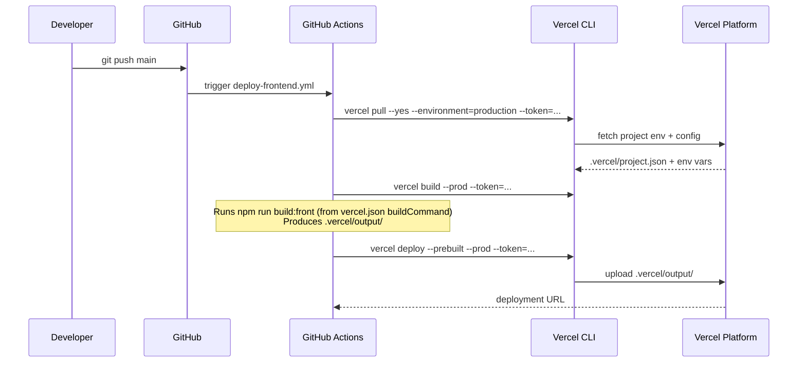

# feat: Deploy frontend to Vercel via GitHub Actions

## Summary

Replace Vercel's automatic GitHub integration with an explicit GitHub Actions workflow that deploys the Angular frontend to Vercel production on every push to `main`. This gives full control over deployment timing, allows quality gates to be inserted, and aligns the frontend pipeline with the existing Render backend deploy pattern.

---

## Problem Frame

Currently the Angular frontend is auto-deployed by Vercel whenever any branch is pushed, using Vercel's built-in GitHub integration. This bypasses GitHub Actions entirely, making it impossible to enforce pre-deploy gates, sequence the frontend deploy after backend deploys, or add custom steps. The backend already deploys via GitHub Actions (`deploy.yml` → Render), so adopting the same pattern for the frontend unifies the deployment model.

**Scope:**

- Move frontend Vercel deployments to GitHub Actions (production only, `main` branch)
- Disable Vercel's automatic GitHub integration to prevent double deployments

**Out of scope:**

- PR preview deployments (deferred by user choice)
- Backend changes
- Any changes to the Nx build configuration or `vercel.json` framework settings

---

## Requirements

- R1: Pushing to `main` triggers a Vercel production deployment from GitHub Actions
- R2: Vercel's automatic GitHub integration is disabled so it does not conflict
- R3: The workflow can be triggered manually via `workflow_dispatch`
- R4: Credentials are stored as GitHub Secrets (not hardcoded)
- R5: The deployment pattern mirrors the existing Render deploy workflow conventions

---

## Key Technical Decisions

**Vercel CLI 3-step pattern over community actions**

Use the official Vercel CLI (`vercel pull` → `vercel build --prod` → `vercel deploy --prebuilt --prod`) rather than `amondnet/vercel-action` or similar. Rationale: this is Vercel's own recommended approach, has no third-party dependency in the deploy critical path, and the `--prebuilt` flag means the CI runner controls the build environment exactly. The community action is better suited for PR preview comment flows, which are out of scope here.

**`git.deploymentEnabled: false` in `vercel.json`**

The correct way to disable Vercel's automatic integration is `"git": { "deploymentEnabled": false }` in `vercel.json`. The older `"github": { "enabled": false }` field is deprecated and must not be used. Using `false` (not a branch map) ensures no branch ever auto-deploys.

**Separate workflow file**

Create `.github/workflows/deploy-frontend.yml` alongside the existing `.github/workflows/deploy.yml` (Render backend). Keeps concerns separate and avoids a monolithic deploy job that is harder to debug independently.

---

## High-Level Technical Design

Sequence for a push to `main`:

---

## Implementation Units

### U1. Disable Vercel automatic GitHub integration

**Goal:** Stop Vercel from auto-deploying on every push so that only the GitHub Actions workflow controls when deployments happen.

**Requirements:** R2

**Dependencies:** none

**Files:**

- `vercel.json`

**Approach:** Add `"git": { "deploymentEnabled": false }` to `vercel.json`. The existing framework, build, output, and rewrite settings are unchanged.

**Test scenarios:**

- Push any branch after this change is merged → Vercel dashboard shows no new deployment triggered automatically

**Verification:** After merging, observe the Vercel dashboard — no deployment should appear for the next non-`main` push. The GitHub Actions deploy workflow (U2) should be the only deployment trigger.

---

### U2. Create Vercel frontend deploy workflow

**Goal:** Add a GitHub Actions workflow that deploys the Angular app to Vercel production on `main` push.

**Requirements:** R1, R3, R4, R5

**Dependencies:** U1 (must be merged first so auto-deploys are off before the workflow takes over), U3 (secrets must be configured before the workflow can run)

**Files:**

- `.github/workflows/deploy-frontend.yml`

**Approach:**

Three-step Vercel CLI pattern inside a single job:

1. `vercel pull --yes --environment=production` — fetches Vercel project config and env vars into `.vercel/`
2. `vercel build --prod` — runs `npm run build:front` (as specified in `vercel.json`) and produces `.vercel/output/`
3. `vercel deploy --prebuilt --prod` — uploads `.vercel/output/` to Vercel production

`VERCEL_ORG_ID` and `VERCEL_PROJECT_ID` are set as workflow-level `env:` vars (the CLI reads them automatically at each step). `VERCEL_TOKEN` is passed via `--token` on each CLI invocation.

Mirror the existing `deploy.yml` pattern: `actions/checkout@v4`, `actions/setup-node@v4` with `.nvmrc`, `npm ci` before the Vercel steps.

Triggers: `push` to `main`, `workflow_dispatch` (manual trigger, same as the Render workflow).

**Patterns to follow:** `.github/workflows/deploy.yml` for job structure, Node.js setup, and trigger conventions.

**Test scenarios:**

- Push to `main` → workflow triggers, all three Vercel CLI steps succeed, Vercel dashboard shows a new production deployment
- Manual `workflow_dispatch` trigger → same outcome as above
- Missing secret (e.g., wrong `VERCEL_TOKEN`) → workflow fails at the `vercel pull` step with a clear auth error (not a silent failure)

**Verification:** Workflow runs green on the next push to `main`. The Vercel dashboard shows the deployment as "Production" and the live URL serves the updated app.

---

### U3. Obtain Vercel credentials and configure GitHub Secrets

**Goal:** Gather the three required secrets and store them in the GitHub repository so the workflow in U2 can authenticate with Vercel.

**Requirements:** R4

**Dependencies:** none (can be done before U1/U2 are merged)

**Files:** _(no code files — GitHub repository settings only)_

**Approach:**

1. **`VERCEL_TOKEN`** — Vercel Dashboard → Settings → Tokens → Create a new token (scope: full account). Store as a GitHub Secret named `VERCEL_TOKEN`.

2. **`VERCEL_ORG_ID` and `VERCEL_PROJECT_ID`** — run `vercel link` locally in the repo root to generate `.vercel/project.json`. The two values are `orgId` and `projectId` in that file. Store them as GitHub Secrets named `VERCEL_ORG_ID` and `VERCEL_PROJECT_ID`.

   Note: `.vercel/` is typically gitignored. It only needs to exist locally long enough to read the values — it is NOT committed.

3. GitHub Secrets location: Repository → Settings → Secrets and variables → Actions → New repository secret.

**Test scenarios:**

- All three secrets present → U2 workflow authenticates successfully at `vercel pull`

**Verification:** Confirm all three secrets appear in the GitHub repo settings under "Actions secrets" before running U2 for the first time.

---

## Open Questions

None — all planning-time questions resolved. Deferred to implementation:

- Exact `VERCEL_TOKEN` scope required (implementer should verify minimum-privilege scope in Vercel docs at creation time)

---

## Scope Boundaries

### Deferred to Follow-Up Work

- PR preview deployments (Vercel preview URL per pull request) — explicitly excluded at user request; can be added as a second workflow job later
- Sequencing frontend deploy after backend deploy (e.g., `needs: deploy-api`) — not needed now, no shared state between them

### Outside scope

- Changes to the NestJS backend or Render deployment
- Nx build configuration changes
- Vercel environment variable management beyond authentication
